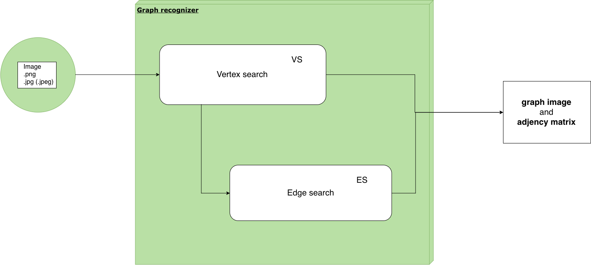
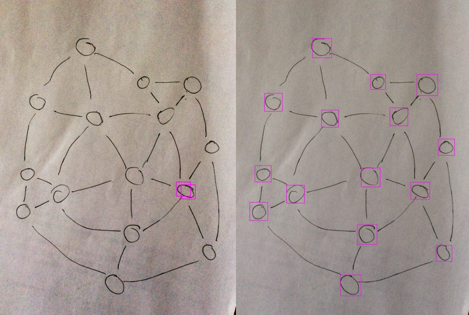
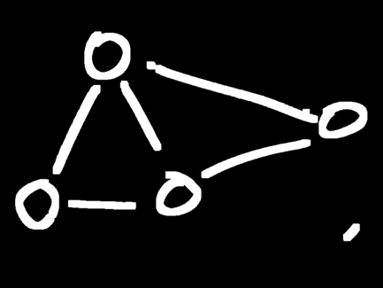
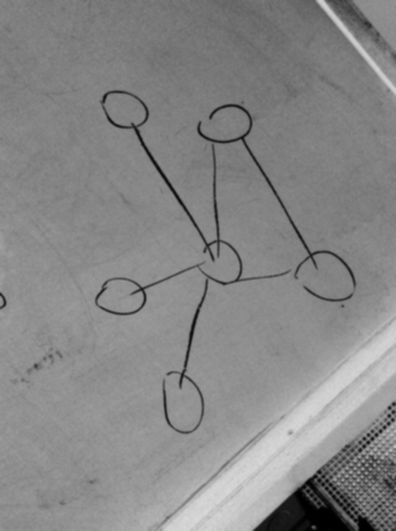
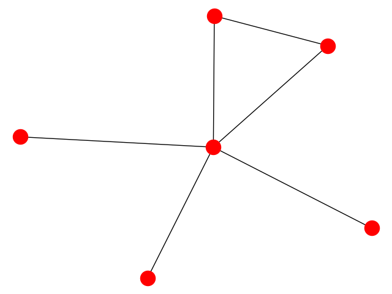
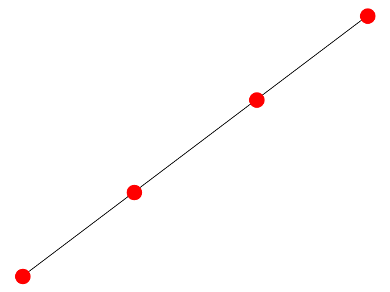
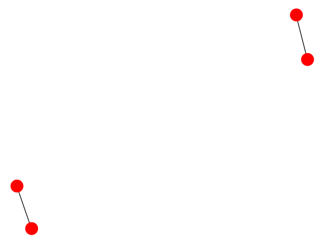

# Оцифровка графов
Автор: Ромакин Д.В.

Привет всем читателям Habrahabr!
В этой статье я хочу поделиться с вами своим первым проектом, связанным с компьютерным зрением. Данная тема "на пальцах" освещается плохо.

#### **В проекте затрагиваются темы:**
- обработка изображения с помощью библиотеки OpenCV;
- сверточные нейронные сети;
- каскады Хаара;
- сравнение различных алгоритмов распознавания из библиотеки OpenCV;
- самописный алгоритм оцифровики графов.

## **Результаты работы**
На вход подается изображение графа, на выходе получаем матрицу смежности.

Дальше используем матрицу, чтобы нарисовать граф с помощью библиотеки [NetworkX](https://networkx.github.io/).

Граф нарисованный на доске (слева), результат - справа:


Граф нарисованный на бумаге (слева), результат - справа:


## **Описание работы системы**


Программа разбита в несколько этапов:

1.  На вход поступает изображение форматом .png .jpg .jpeg, и др. и запускается скрипт для подготовки данных. (удаление шумов и инвертирование цветов в 1 канал).

2.  VertexSearch: На изображении с помощью каскадов Хаара ищем вершины графа, затем запускаем фильтрацию в 2 этапа (сверточная нейронная сеть (СНС) и дополнительный алгоритмический фильтр), сохраняем полученные данные файл для следующего этапа.

3.  EdgeSearch: Определяем начало движения Tracker* у каждой вершины графа с помощью дополнительных прямоугольников.

4.  EdgeSearch: Запускаем Tracker* для определения какие вершины соединены.

5.  Составляется удобный формат для дальнейшей визуализации.

P.s. Tracker* - собственное название разработанного алгоритма.

### Визуализация полного цикла работы


## **Подготовка данных**
Подготовка данных - это маленький, но значимый шаг в алгоритме работы системы.

### Как работает

Изображение подается на вход с префиксом green/white:

1.  Уменьшаем изображение так, чтобы длина и ширина были меньше, чем 900 пикселей, сохраняя пропорции.
2.  Green - изображение с доски.
     * **Этапы:**
     * 2.1. переводим в 1 канал;
     * 2.2. убираем шумы и инвертируем цвета (чтобы выделить черным контур графа);
3. White - изображение с листка бумаги.
     * **Этапы:**
     * 2.1. переводим в 1 канал;

## **Поиск вершин графа (Vertex Search)**
Обработанное изображение подается на вход алгоритму, который состоит из несколько шагов:

1.  [Каскады Хаара](https://habr.com/ru/company/recognitor/blog/228195/).

2.  Фильтр, реализованный с помощью сверточной нейронной сети.

3.  Дополнительный фильтр пересечений.

## **Каскады Хаара**
### Почему каскады Хаара?

Для поиска окружностей рассматривалаись 4 алгоритма:
1.  Simple Blob Detector ([example](https://www.learnopencv.com/blob-detection-using-opencv-python-c/), [documentation](https://docs.opencv.org/3.4.3/d0/d7a/classcv_1_1SimpleBlobDetector.html))

2.  MSER Blob Detector ([example](http://qaru.site/questions/2443082/merge-mser-detected-objetcs-opencv-python), [documentation](https://docs.opencv.org/2.4/modules/features2d/doc/feature_detection_and_description.html?highlight=mser))

3.  Hough Circles ([example](https://www.pyimagesearch.com/2014/07/21/detecting-circles-images-using-opencv-hough-circles/), [documentation](https://opencv-python-tutroals.readthedocs.io/en/latest/py_tutorials/py_imgproc/py_houghcircles/py_houghcircles.html))

4. Каскады Хаара

Первые 2 не подошли из-за маленького числа распознанных вершин при тестировании, а предпоследний алгоритм может конкурировать с каскадами, но ему требуется настройка параметров для каждого изображения, по этой причине были выбраны Каскады Хаара.

### Подготовка данных
Для успешного обучения потребуется большое количество «отрицательных» и «положительных» образцов. Для более удобной разметки изображений используется разработанная программа, которая позволяет получить изображения вершин графа, путем выделения нужной области в ходе работы программы, а также сформировать индексный файл с расширением .dat для дальнейшего обучения каскадов Хаара. При малом количестве изображений можно сгенерировать дополнительные наборы данных путем поворота их на определенный угол, который задается перед запуском, или на произвольный угол (от 0 до 180 градусов).

Программу для получения вершин графа и индексного файла с расширением .dat можно найти в моем репозитории [тут](https://github.com/Dmitriy1594/NeiroGraphDetect/tree/Steps-of-project/Dataset/markup).
Программу для генерации дополнительного набора данный путем поворота можно также найти в моем репозитории [тут](https://github.com/Dmitriy1594/NeiroGraphDetect/tree/Steps-of-project/Dataset/refactor_dataset).

### Обучение признаков Хаара
Информацию о том как обучить каскады Хаара локально у себя на компьюторе можно найти [тут](https://habr.com/ru/post/208092/), [тут](https://docs.opencv.org/3.3.0/dc/d88/tutorial_traincascade.html) и [тут](https://medium.com/@a5730051/train-dataset-to-xml-file-for-cascade-classifier-opencv-43a692b74bfe).
Обучение различных моделей Хаара производилось на облачном вычислительном ресурсе:[Google Cloud Platform](https://cloud.google.com), на виртуальной машине Ubuntu.

Этапы запуска и скрипты можно посмотреть в репозитории [здесь](https://github.com/Dmitriy1594/NeiroGraphDetect/tree/Steps-of-project/Vertex/haar/GCP/script).

Каскады Хаара обучались долго из-за того, что обучал на CPU. Поиск для обучения на GPU ничего не дал, буду благодарен за пруфы в комментариях.

### Выбор обученной модели Хаара
Код для тестирования каскада Хаара:
```python
def haartest(image):
    # This is the cascade we just made. Call what you want
    cascade30 = cv2.CascadeClassifier('./models/haar/haar_2020_2/cascade.xml')
    img = cv2.imread(image)
    if img is None:
        exit(0)
    img_c = img.copy()
    # filters
    gray = cv2.cvtColor(img_c, cv2.COLOR_BGR2GRAY)
    # gaus = cv2.GaussianBlur(gray, (5, 5), 2)
    vertex30 = cascade30.detectMultiScale(gray)
    it = 0
    # get rectangle
    for (x, y, w, h) in vertex30:
        crop_img = img[y:y + h, x:x + w]
        label = neural_network_2828(crop_img)

        # put text
        if (label[0] == "Vertex"):
            cv2.rectangle(img, (x, y), (x + w, y + h), (255, 0, 255), 2)
            font = cv2.FONT_HERSHEY_SIMPLEX
            cv2.putText(img, 'V'+label[2], (x - 2, y - 2), font, 0.5, (255, 0, 255), 1, cv2.LINE_AA)
        else:
            cv2.rectangle(img, (x, y), (x + w, y + h), (0, 255, 0), 2)
            font = cv2.FONT_HERSHEY_SIMPLEX
            cv2.putText(img, 'NV'+label[2], (x - 2, y - 2), font, 0.5, (0, 255, 0), 1, cv2.LINE_AA)
        it += 1

    # save image
    x = image.split("/")
    print(x[-1])
    path = './results/result_Haar_NN_test/'
    # cv2.imshow('img',img)
    cv2.imwrite(path + x[-1], img)
```

#### Как выбирается лучший каскад?
1. Создаем файл csv для дальнейшего его анализа c помощью библиотеки pandas и seaborn
2. Анализируем данные, строим диаграммы для каждой модели
3. Выбираем самый оптимальный

#### Диаграммы
Проанализируем каждый каскад в целом с помощью диаграмм:


**Ось ординат** - число распознанных вершин в общей сумме

**Ось абсцисс** - количество вершин

Видно, что минимальное число ложных срабатываний (число нераспознанных вершин) имеет каскад Хаара 20x20 2 типа.

**Отсюда делаем вывод:**
Отсюда делаем вывод - будем использовать Хаар 20x20 2 типа:


## **Фильтр сверточной нейронной сети**
Из-за того, что каскады Хаара иногда выделяют пересечения линий, похожие на вершину графа, то данные случаи необходимо свести к минимуму с помощью сверточной нейронной сети. Задача сверточной нейронной сети (СНС) - классификация вершин.

О том как работает свертка в изображении можно найти в моем репозитории в ветке Steps-of-project: [Ccылка](https://github.com/Dmitriy1594/NeiroGraphDetect/tree/Steps-of-project/Image%20processing/Convolutional-Layers).
Подробнее о том, что такое сверточная нейронная сеть - [ссылка](https://habr.com/ru/post/348000/).

### Архитектура
**За основу архитектуры нейронной сети была взята сверточная нейронная сеть LeNet5:**


Так как вершина графа является кругом, то для измененной архитектуры СНС число features maps на каждом этапе свертки примерно такое же, как и для различных букв алфавита, которые используется для обучения нейронной сети на изображении.

**В результате многочисленных экспериментов была найдена оптимальная архитектура СНС:**


На выходе два нейрона, которые дают вероятностную оценку вершина или не вершина.

**Код для обучения СНС:**
```python
# LeNet architecture
def build(width, height, depth, classes):
    # initialize the model
    model = Sequential()
    inputShape = (height, width, depth)

    # if we are using "channels first", update the input shape
    if K.image_data_format() == "channels_first":
        inputShape = (depth, height, width)

    # first set of CONV => RELU => POOL layers
    model.add(Convolution2D(20, (5, 5), activation='relu',
                            input_shape=(height, width, depth)))

    model.add(MaxPooling2D(pool_size=(2, 2), strides=(2, 2)))

    # second set of CONV => RELU => POOL layers
    model.add(Convolution2D(50, (5, 5), activation='relu'))
    # model.add(Activation("relu"))
    model.add(MaxPooling2D(pool_size=(2, 2), strides=(2, 2)))

    # first (and only) set of FC => RELU layers
    model.add(Flatten())
    model.add(Dense(500, activation='relu'))
    model.add(Dropout(0.5))

    # softmax classifier
    model.add(Dense(classes))
    model.add(Activation("softmax"))

    # return the constructed network architecture
    return model

# initialize the number of epochs to train for, initialize learning rate,
# and batch size
EPOCHS = 27
INIT_LR = 1e-3
BS = 32

...

# partition the data into training and testing splits using 75% of
# the data for training and the remaining 25% for testing
(trainX, testX, trainY, testY) = train_test_split(data,
labels, test_size=0.25, random_state=42)

# convert the labels from integers to vectors
trainY = to_categorical(trainY, num_classes=2)
testY = to_categorical(testY, num_classes=2)

# construct the image generator for data augmentation
aug = ImageDataGenerator(rotation_range=30, width_shift_range=0.1,
height_shift_range=0.1, shear_range=0.2, zoom_range=0.2,
horizontal_flip=True, fill_mode="nearest")

# initialize the model
print("[INFO] compiling model...")
model = build(width=28, height=28, depth=3, classes=2)
opt = Adam(lr=INIT_LR, decay=INIT_LR / EPOCHS)
# SGD(momentum=0.9)
model.compile(optimizer=opt, loss='binary_crossentropy', metrics=["accuracy"])

# train the network
print("[INFO] training network...")
H = model.fit_generator(aug.flow(trainX, trainY, batch_size=BS),
validation_data=(testX, testY), steps_per_epoch=len(trainX) // BS,
epochs=EPOCHS, verbose=1)
```

#### **Результаты обучения СНС**


#### Статистика по СНС:
Код для тестирования СНС:
```python
def neural_network(image, dirtocnn):
    orig = image
    # pre-process the image for classification
    image = cv2.resize(image, (28, 28))
    image = image.astype("float") / 255.0
    image = img_to_array(image)
    image = np.expand_dims(image, axis=0)
    print("[INFO] loading network...")
    # load model
    model = load_model('./../models/neural_networks/' + dirtocnn)
    vertex = 0
    notVertex = 0
    print(dirtocnn.split('_')[0])
    # classify the input image
    if dirtocnn.split('_')[0] == 'not':
        (vertex, notVertex) = model.predict(image)[0]
    else:
        (notVertex, vertex) = model.predict(image)[0]

    label = "Vertex" if vertex > notVertex else "Not Vertex"
    proba = vertex if vertex > notVertex else notVertex
    labelprob = "{}: {:.2f}%".format(label, proba * 100)
    return (label, labelprob, str(float("{0:.2f}".format(proba * 100))))
```
**Диаграмма**


Для .model:


**Ось ординат** - количество изображений

**Ось абсцисс**: 0 - количество изображений не совпавшим с их числом на изображении, 1 - инвертированный 0.

Для .model_NV:

**Ось ординат** - количество изображений.

**Ось абсцисс** - количество изображений, попавших под фильтрацию.

#### Лучший результат:


**Ось ординат** - количество изображений

**Ось абсцисс**: 0 - количество изображений не совпавшим с их числом на изображении, 1 - инвертированный 0.

**С учетом экспериментов лучше всего себя показала модель vertex_sort.model.**
Было использовано 15 фото для анализа фильтра, основанный на нейронной сети. Общее затраченное время на анализ моделей: 4,5 часа. Фильтрация, основанная на нейронной сети - дорогостоящая операция, но эффективная.

## **Дополнительный фильтр пересечений**
### Данный фильтр позволяет избавится от некоторых случаев пересечения:


**Слева** - пересечение, которое вычислил алгоритм, а **справа** - результат.
Все подобные случаи пересечения учитываются при выполнения работы.

### Как это выглядит динамически:


## **Результаты работы Каскадов Хаара и СНС**
Каскад Хаара | Фильтр СНС | Результат
--- | --- | ---
  |    |  
  |    |  


## **Определение ребер графа (Edge Search)**
Для того, чтобы определить какие вершины графа соединены между собой, необходимо знать:
- Область начала ребра (линии)
- Область пересечения ребра (линии) с другими

Было сделано несколько вариантов:

Поиск областей начал ребер (линий) | Результат | Поиск областей пересечений ребер (линий) | Результат
--- | --- | --- | ---
Каскады Хаара | Любой шум, который есть на изображении (точка, иное множество пикселей) может стать областью началом ребра (линии), поэтому число ложных срабатываний оказалось достаточно велико. По этой причине пришлось отказаться от данной идеи. | Каскады Хаара | Использование каскадов не подходит из-за малой точности и большой погрешности. Некоторый процент распознанных областей начал ребер (линий) и областей пересечений является ложным срабатыванием, поэтому точность еще ниже, чем предполагалось.
Hough Lines |  Используя алгоритм HoughLinesP из библиотеки OpenCV, удалось достичь очень хорошего результата, но у него есть один большой минус, который не позволил его использовать в данной задаче - подбор параметров функции для каждого изображения.  | Сращивание маленьких линий с помощью Hough Lines | На основе алгоритма HoughLinesP была создана программа, которая позволяет разбить ребро (линию) после обработки алгоритмом Canny из OpenCV на маленькие линии, чтобы срастить их потом в одну. Результат очень хороший, но как и для поиска начал - необходимо подбирать параметры функции для каждого изображения. 

### Вывод
Ни один из предложенных алгоритмов не подходит, поэтому был создан свой алгоритм с названием **Tracker("Умный ползунок")**, который **"пробегается"** по пикселям ребра (линии) графа на изображении (подробнее далее).

## **Tracker**
Tracker("Умный ползунок") работает в 2 этапа:
1. Поиск области начала ребра (линии)
2. Проход по пикселям ребер (линии) графа на изображении с определением какие вершины соединены между собой

### Поиск области начала ребер
В данном случае используется метод вспомогательных прямоугольников, пересечение с ребрами которых позволяет найти область начала ребра (линии), а в последствии - область начала движения для Tracker.

#### Этапы работы:
1. На вход алгоритму Canny подаем обработанное изображение;

  

2. С помощью свертки соединяем 2 линии после алгоритма Canny;

  

3. Уменьшаем размер линии до малого числа пискселей, чтобы не было разрыва;

  

4. То множество пикселей, которое попало в область **дополнительных прямоугольников** - удаляется, сохраняя множества пикселей, которые попали на пересечения самых больших для каждой вершины прямоугольников и ребер графа;

  

5. Белая часть - это множество пикселей пересечения, поэтому вычисляем центральный пиксель пересечения для каждой области;

  

6. Получаем области (окружности) начала ребра (линии), центрами которых являются центральные пиксели;

  

7. После удаления в 5 пукте находим ребра графа (множество пикселей), по которым будет передвигаться Tracker ("Умный ползунок").

  

P.s. **Дополнительные прямоугольники** строятся на основе выделенной области Хаара.

#### Результат:


### Проход по пикселям ребра (линии) графа на изображении
### Условие соединенности вершин
Для того, чтобы подтвердить, что линия принадлежит данным двум вершинам, необходимо, чтобы Tracker прошел от одной точки к другой, хотя бы один раз.

### Как двигается Tracker?
Движение основано на пересечении окружности с ребром ("дорогой" Tracker) графа.


#### Алгоритм движения
1.	Используя координаты центрального пикселя области начала ребра (линии), строится красная окружность;
2.	Находится пересечение красной окружности с пикселями ребра (дороги) Tracker;
3.	Множество пикселей пересечения приводится к одному пикселю пересечения, который является центральным пикселем для новой окружности;
4.  Рисуется новая окружность, центром которой является новый центральный пиксель пересечения;
5.	Циклически выполняем 2-4, до тех пор, пока не встретим:
  - Другую точку начала линии;
  - Последнюю область (последний пиксель) ребра (окончание дороги).

Движение Tracker | Траектория движения Tracker
------------ | -------------
 | 

### Что происходит при различных выходах в 5 этапе?
Включается прострел (Tracker Shoot), который проверяет соединено ли ребро (линия) с вершиной графа (красным прямоугольником Хаара). Более подробно в главе про Tracker Shoot.

### Tracker Shoot
Данный алгоритм начинает работать после встречи одно из условий 5 этапа алгоритма движения Tracker.
Рассмотрим работу на примере.

Tracker Shoot | Tracker Shoot Zoom
------------ | -------------
 | 

Слева на картинке изображен прострел, а справа - увеличенная картинка прострела.

### Как работает Tracker Shoot (прострел)?
1. При достижении алгоритмом движения выхода на 5 этапе в обоих случаях сохраняются координаты центрального пикселя данной окружности и предыдущей (если встретили другую точку начала - белая и красная окружности, если последнюю область ребра - 2 красные окружности).
2. Используя выражение прямой  и имея 2 пары координат центральных пикселей, находим угловой коэффициент  для данного ребра.
3. Используя координаты ближайших вершин прямоугольника относительно координат последнего центрального пикселя (белой или красной окружности) получаем границы значений углового коэффициента, при которых данное ребро соединено с вершиной графа.
4. Если угловой коэффициент  лежит в границах значений, то ребро соединяет 2 вершины, иначе - ребро огибает вершину.

**P.s.** Если коэффициент находится в допустимой области, то картинка будет такая же как сверху.

## **Проблемы**
### Основные проблемы
1.	При разрыве линии алгоритм движения Tracker может остановиться, т.к. в провал попадет точка пересечения окружности с траекторией Tracker.
2.	При пересечении линий алгоритм не работает

####  Пример проблемы:


3.	Определение точек начала линии иногда дает плохой результат, если какая-либо линия проходит рядом с областью вершины (пример ниже).

####  Пример проблемы:

Original image -> Preprocessing | Vertex Search with action | Find Start | Tracker | Result
--- | --- | --- | --- | ---
 |  |  |  | 

4. Для корректной работы этапа подготовки необходимо указывать индекс для фотографии, которая поступает на вход.
5. Отсутсвие многопоточности, для поиска вершин и Tracker.

## **Примеры**
### Положительный результат
Original image -> Preprocessing | Vertex Search | Find Start | Tracker | Result
--- | --- | --- | --- | ---
 |  |  |  | 
 |  |  |  | 
 |  |  |  | 

###  Пример, где активируется дополнительный фильтр пересечений:
Original image -> Preprocessing | Vertex Search with action | Find Start | Tracker | Result
--- | --- | --- | --- | ---
 |  |  |  | 

## **Литература**
1.  https://www.pyimagesearch.com/2017/08/21/deep-learning-with-opencv/
2.  https://www.pyimagesearch.com/category/object-detection/
2.	https://habr.com/ru/post/309508/
3.  https://habr.com/ru/post/312450/
3.	https://www.asozykin.ru/courses/nnpython-intro
4.	https://proglib.io/p/neural-nets-guide/

## **Github**
[Мой Github](https://github.com/Dmitriy1594/NeiroGraphDetect)
