# Курсовой проект
## Оцифровка графов
Создатель: Ромакин Д.В.

Привет всем читателям Habrahabr, в этой статье я хочу поделиться с Вами своим первым проектом, связанным с нейронными сетями. Особенность темы - ее еще никто не рассматривал, а она затрагивает множество различных областей. Сразу скажу: статья достаточно длинная, но интересная.

**В проекте затрагиваются темы:**
- Обработка изображения с помощью библиотеки OpenCV
- Сверточные нейронные сети
- Каскады Хаара
- Сравнение различных алгоритмов распознавания из библиотеки OpenCV


### Начну сразу с результатов
Данная работа посвящалась оцифровке графов, если граф без пересечений и без весов, то задача выполнена, иначе – есть над чем работать.

### Результаты на текущей стадии
На вход подается изображение с графом, нарисованным
- на доске (слева), результат - справа


- на бумаге (слева), результат - справа

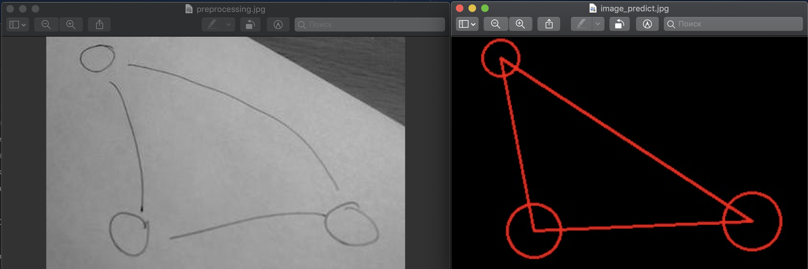

### Визуализация работы


## Оглавление
  * Описание работы системы
  * Предобработка
    - Фильтрация с помощью сверточных ядер
    - Итоговая программа предобработки изображения
  * Поиск вершин графа
    - Каскады Хаара
      + Почему каскады Хаара?
      + Подготовка данных
      + Обучение признаков Хаара
      + Выбор обученной модели Хаара
    - Фильтр СНС
    - Дополнительный фильтр пересечений
  * Распознавание линий
    - Поиск начал линий
      + Поиск начал линий с помощью Каскадов Хаара
      + Поиск начал линий с помощью HoughCirclesP
    - Поиск пересечений линий с помощью Каскадов Хаара
    - Tracker
      + Поиск начал линий
      + Движение Tracker
        * Условие соединенности вершин
        * Как движется Tracker
        * Что происходит при различных выходах в пункте 4
      + Tracker Shoot
      + Основные проблемы и их решения
  * Выводы
  * Литература


**Описание работы системы**
=================


Программа разбита в несколько этапов:

1.  На вход поступает изображение форматом .png .jpg .jpeg и др. и
    запускается скрипт с предобработкой (удаление шумов и инвертирование
    цветов в 1 канал).

2.  VS: На изображении с помощью каскадов Хаара ищем вершины графа,
    затем запускаем фильтрацию в 2 этапа (СНС и дополнительный
    алгоритмический фильтр), сохраняем полученные данные файл для
    следующего этапа.

3.  ES: Определяем начало движения Tracker у каждой вершины графа с
    помощью дополнительных прямоугольников.

4.  ES: Запускаем Tracker для определения какие вершины соединены.

5.  Составляется удобный формат для дальнейшей визуализации.

**Предобработка**
=================

После анализа входных изображений пришлось использовать фильтр Гаусса и перевод в один канал.

Изображение подается на вход с префиксом green/white:

1.  Если изображение больше, чем 900 пикселей в ширине или высоте, то
    уменьшаем размер до 900x900 (размер на высоте или ширине должен быть
    меньше или равен 900). Если изображение не квадратное, то сохраняя
    пропорции уменьшаем самую большую сторону до 900.

2.  Green - изображение с доски. Этапы: переводим в 1 канал, убираем
    шумы и инвертируем цвета (чтобы выделить черным контур графа)

3.  White - изображение с листка бумаги. Этапы: переводим в 1 канал.

Скрипт Python:
```python
def preprocessing(image, type=None, save=False):
    img = image.copy()
    height, width, depth = img.shape

    if ((height > 900) | (width > 900)):
        img = module.resizeImage(img, width=900, height=900, save=True)

    if ((type == 'Green') | (type == 'green')):
        # filtering
        gray = cv2.cvtColor(img, cv2.COLOR_BGR2GRAY)
        kernel_size = 5
        blur_gray = cv2.GaussianBlur(gray, (kernel_size, kernel_size), 2)
        imgbit = cv2.bitwise_not(blur_gray)
        if save == True:
            module.saveImage(path + 'preprocessing.jpg', imgbit)

        return imgbit
    else:
        gray = cv2.cvtColor(img, cv2.COLOR_BGR2GRAY)
        if save == True:
            module.saveImage(path + 'preprocessing.jpg', gray)

        return gray
```

**Поиск вершин графа**
======================

Обработанное изображение подается на алгоритм, который состоит из
несколько шагов:

1.  [Каскады Хаара](https://habr.com/ru/company/recognitor/blog/228195/)

2.  Фильтр, реализованный с помощью сверточной нейронной сети

3.  Алгоритмический фильтр

Рассмотрим каждый из этапов более детально.

**Каскады Хаара**
-----------------

### **Почему каскады Хаара?**

Для поиска окружностей рассматривалаись 3 алгоритма:
1.  Simple Blob Detector ([example](https://www.learnopencv.com/blob-detection-using-opencv-python-c/), [documentation](https://docs.opencv.org/3.4.3/d0/d7a/classcv_1_1SimpleBlobDetector.html))
2.  MSER Blob Detector ([example](http://qaru.site/questions/2443082/merge-mser-detected-objetcs-opencv-python), [documentation](https://docs.opencv.org/2.4/modules/features2d/doc/feature_detection_and_description.html?highlight=mser))
3.  Hough Circles ([example](https://www.pyimagesearch.com/2014/07/21/detecting-circles-images-using-opencv-hough-circles/), [documentation](https://opencv-python-tutroals.readthedocs.io/en/latest/py_tutorials/py_imgproc/py_houghcircles/py_houghcircles.html))

Первые 2 не подошли из-за маленького числа распознанных вершин при тестировании,
а последний алгоритм (3) может конкурировать с каскадами,
но ему требуется правильные коэффициенты для каждого изображения.

#### Основа каскада Хаара
В основе каскадов Хаара из библеиотеки OpenCV лежит метод Виолы-Джонса (Viola-Jones)
(чаще всего его используют для распознавания лиц),
который основывается на следующих принципах:
1. используются изображения в [интегральном представлении](https://en.wikipedia.org/wiki/Summed-area_table), что позволяет вычислять быстро необходимые объекты;
2. используются [признаки Хаара](https://en.wikipedia.org/wiki/Haar-like_feature), с помощью которых происходит поиск нужного объекта;
3. используется [boost](http://machinelearning.ru/wiki/index.php?title=Бустинг) (от англ. boost – улучшение, усиление) для выбора наиболее подходящих признаков для искомого объекта на данной части изображения;
4. все признаки поступают на вход [классификатора](https://ru.wikipedia.org/wiki/Задача_классификации), который даёт результат «верно» либо «ложь»;
5. используются каскады признаков для быстрого отбрасывания окон, где не найден искомый объект.

Ссылка: [Подробное описание про каждый признак](https://habr.com/ru/post/133826/)

#### Кратко о признаках Хаара
**В стандартном методе Виолы – Джонса используются прямоугольные признаки, изображенные на рисунке ниже, они называются примитивами Хаара:**
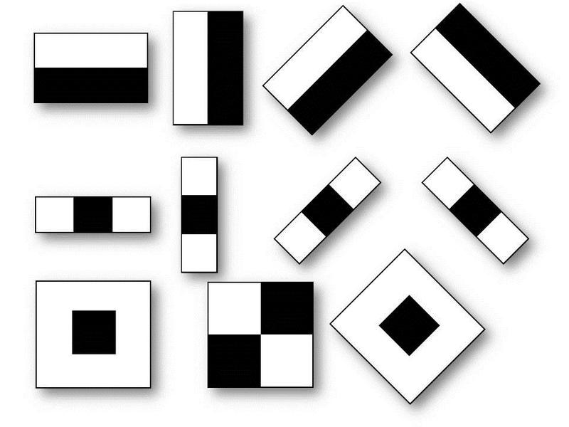

**В расширенном методе Виолы – Джонса, использующемся в библиотеке OpenCV используются дополнительные признаки:**
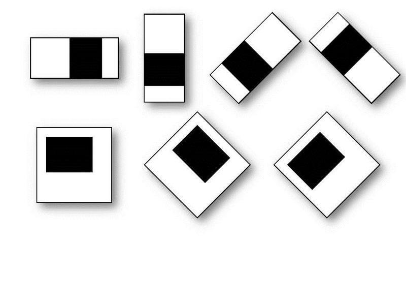


### **Подготовка данных**

**Все разработанные программы применялись для создания датасета, в последствии - для обучения каскадов Хаара.**

#### **Программа для создания набора данных для обучения**

Для успешного обучения потребуется большое количество «отрицательных» и
«положительных» образцов. Для более удобной разметки изображений
используется разработанная программа, которая позволяет получить
изображения вершин графа, путем выделения нужной области в ходе работы
программы.


**Пример данных для обучения:**


Также с помощью программы можно сформировать индексный файл с расширением .dat для дальнейшего обучения каскадов Хаара.

#### **Программа для генерации дополнительного набора данных для обучения**


При малом количестве изображений можно
сгенерировать дополнительные наборы данных путем поворота их на
определенный угол, который задается перед запуском, или на произвольный
угол (от 0 до 180 градусов).

### **Обучение признаков Хаара**

#### **Визуализация обучения каскада Хаара**
Фичи, которые выделяет каскад при обучении можно увидеть, используя следующий скрипт: (подробнее: [тут](https://docs.opencv.org/3.3.0/dc/d88/tutorial_traincascade.html))
```
opencv_visualisation --image=/data/object.png --model=/data/model.xml --data=/data/result/
```
**Пример детекции лица:**

[](http://www.youtube.com/watch?v=hPCTwxF0qf4 "Визуализация обучения каскадов Хаара")

#### **Кратко об обучении каскадов Хаара на облачном ресурсе**
Информацию о том как обучить каскады Хаара локально у себя на компьюторе можно найти [тут](https://habr.com/ru/post/208092/), [тут](https://docs.opencv.org/3.3.0/dc/d88/tutorial_traincascade.html) и [тут](https://medium.com/@a5730051/train-dataset-to-xml-file-for-cascade-classifier-opencv-43a692b74bfe).
Обучение различных моделей Хаара производилось на облачном вычислительном ресурсе: Google Cloud Platform, на виртуальной машине Ubuntu 16.04 LTS.


Обучение каскадов осуществлялось следующим
образом: с помощью данной консоли запускали скрипт **haar1515.sh**,
который запускал обучение. В этом файле прописаны команды для запуска
обучения, фото ниже:


Для того, чтобы избежать постоянного подключения по ssh к удаленной машине, скрипт запускался как demon в Ubuntu, т.е. в фоновом режиме и с
записью выходной информации в файл с расширением .txt, с помощью
следующей команды:

```
$ nohup ./haar1515.sh \>\$HOME/haar1515.txt 2\>&1 \< /dev/null &
```

Для отслеживания аппаратных ресурсов и прогресса применялась старая добрая утилита
**htop**:


C помощью **htop** можно отследить потребляемую оперативную память, а
также нагрузку на процессор, благодаря чему было выявлено, что программа для обучения из библиотеки OpenCV не выделяет память в указанном размере в скрипте **haar1515.sh**.

Конечный результат вывода в файл **haar1515.txt** (последняя стадия обучения)


Каскады Хаара обучаются довольно долго из-за того, что обучаются на процессоре, а не на GPU (пробовал подключать GPU - бузуспешно), в данном случае 23 стадия обучалась 31 день. Это не предел, поэтому каскады Хаара обучались не более, чем на 25 эпохах, используя 8 ядер и не менее 40 Гб оперативной памяти.

### **Выбор обученной модели Хаара**
#### **Скрипт для тестирования каскада Хаара**
```python
def haartest(image):
    # This is the cascade we just made. Call what you want
    cascade30 = cv2.CascadeClassifier('./models/haar/haar_2020_2/cascade.xml')
    img = cv2.imread(image)
    if img is None:
        exit(0)
    img_c = img.copy()
    # filters
    gray = cv2.cvtColor(img_c, cv2.COLOR_BGR2GRAY)
    # gaus = cv2.GaussianBlur(gray, (5, 5), 2)
    vertex30 = cascade30.detectMultiScale(gray)
    it = 0
    # get rectangle
    for (x, y, w, h) in vertex30:
        crop_img = img[y:y + h, x:x + w]
        label = neural_network_2828(crop_img)

        # put text
        if (label[0] == "Vertex"):
            cv2.rectangle(img, (x, y), (x + w, y + h), (255, 0, 255), 2)
            font = cv2.FONT_HERSHEY_SIMPLEX
            cv2.putText(img, 'V'+label[2], (x - 2, y - 2), font, 0.5, (255, 0, 255), 1, cv2.LINE_AA)
        else:
            cv2.rectangle(img, (x, y), (x + w, y + h), (0, 255, 0), 2)
            font = cv2.FONT_HERSHEY_SIMPLEX
            cv2.putText(img, 'NV'+label[2], (x - 2, y - 2), font, 0.5, (0, 255, 0), 1, cv2.LINE_AA)
        it += 1

    # save image
    x = image.split("/")
    print(x[-1])
    path = './results/result_Haar_NN_test/'
    # cv2.imshow('img',img)
    cv2.imwrite(path + x[-1], img)
```

#### **Как выбирается лучший каскад?**
**Создаем файл csv для дальнейшего его анализа c помощью библиотеки pandas и seaborn**
```python
forFileDic = {'image': image}   # dictionary with information about images

with open('./../result_testing.csv', mode='w') as csv_file:
    fieldnames = forFileDic.keys()
    writer = csv.DictWriter(csv_file, fieldnames=fieldnames)
    writer.writeheader()

    for i in range(0, len(forFileDic.get('image'))):
        row = {}
        for header in fieldnames:
            el = forFileDic.get(header)   # get list
            row[header] = el[i]

        print('Row: ', row)
        writer.writerow(row)
```


##### Analysis csv file
**Считаем данные из файла в память в виде объекта Pandas.DataFrame**
```python
data = pd.read_csv('./../result_testing.csv')
```

**Всего было создано 9 моделей каскадов Хаара:**


**Выбор каскада Хаара осуществляется следующим образом:**


**Из-за того, что на каждой картинке было не
менее 2 вершин графа, то выбираем тот каскад, у которого наименьшее
число 0 распознаваний вершин.**


**Проанализируем каждый каскад в целом с помощью диаграмм:**


**С помощью диаграммы находим, что
минимальное число ложных срабатываний (число нераспознанных вершин)
имеет каскад Хаара 20x20 2 типа.**

**Отсюда делаем вывод:**
Лучшая обученная модель каскадов - Хаар 20x20 2 типа:


**Фильтр СНС**
--------------
Из-за того, что каскады Хаара иногда выделяют пересечения линий, похожие на вершину графа, то данные случаи необходимо свести к минимуму с помощью сверточной нейронной сети. Задача СНС (Сверточной Нейронной Сети) - классификация вершин.

О том как работает свертка в изображении можно найти в моем репозитории в ветке Steps-of-project: [Ccылка](https://github.com/Dmitriy1594/NeiroGraphDetect/tree/Steps-of-project/Image%20processing/Convolutional-Layers)

Подробнее о том, что такое сверточная нейронная сеть - [ссылка](https://habr.com/ru/post/348000/)

#### Архитектура
**За основу архитектуры нейронной сети была
взята сверточная нейронная сеть LeNet5:**


**Так как вершина графа является кругом, то для измененной архитектуры СНС
число features maps на каждом этапе свертки примерно такое же, как и для
различных букв алфавита, которые используется для обучения нейронной
сети на изображении.**

**В результате многочисленных экспериментов
была найдена оптимальная архитектура СНС:**


На выходе два нейрона, которые дают вероятностную оценку вершина или не вершина в %.

#### **Скрипт для тестирования СНС**
```python
def neural_network(image, dirtocnn):
    orig = image
    # pre-process the image for classification
    image = cv2.resize(image, (28, 28))
    image = image.astype("float") / 255.0
    image = img_to_array(image)
    image = np.expand_dims(image, axis=0)
    print("[INFO] loading network...")
    # load model
    model = load_model('./../models/neural_networks/' + dirtocnn)
    vertex = 0
    notVertex = 0
    print(dirtocnn.split('_')[0])
    # classify the input image
    if dirtocnn.split('_')[0] == 'not':
        (vertex, notVertex) = model.predict(image)[0]
    else:
        (notVertex, vertex) = model.predict(image)[0]

    label = "Vertex" if vertex > notVertex else "Not Vertex"
    proba = vertex if vertex > notVertex else notVertex
    labelprob = "{}: {:.2f}%".format(label, proba * 100)
    return (label, labelprob, str(float("{0:.2f}".format(proba * 100))))
```

#### Статистика по СНС:
Для создания csv файла использовался тот же скрипт, что и для каскадов Хаара.
```python
dt = data
plt.figure(dpi=900)
dt.hist(color = 'k', figsize=(15,10))
plt.show()
```


#### Лучший результат:
```python
sns.countplot(data['vertex_sort.model'])
```


Было использовано 15 фото для анализа фильтра, основанный на нейронной сети. Общее затраченное время на анализ моделей: 4,5 часа. Следовательно, фильтрация, основанная на нейронной сети - дорогостоящая операция, но результативная, т.к. на случайных данных 40% фото были доведены до идеала (идеал - когда на фото были распознаны все вершины).

**Дополнительный фильтр пересечений**
-------------------------------------
**Данный фильтр позволяет избавится от некоторых случаев пересечения:**


**Слева** - пересечение, которое поймал алгоритм, а **справа** - результат.

Все подобные случаи пересечения учитываются при выполнения работы.

**Результат работы каскада Хаара**
-------------------------------------
Каскад Хаара | Фильтр СНС | Результат
--- | --- | ---
  |    |  
  | 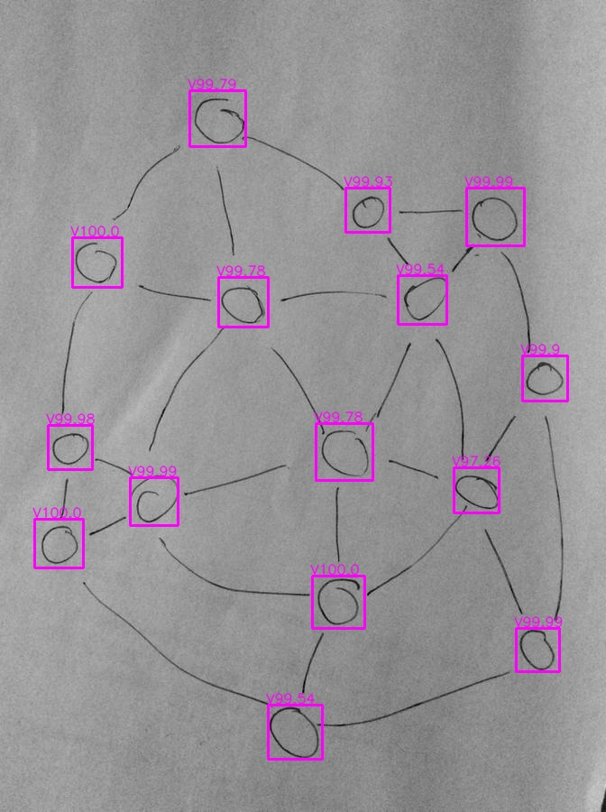   |  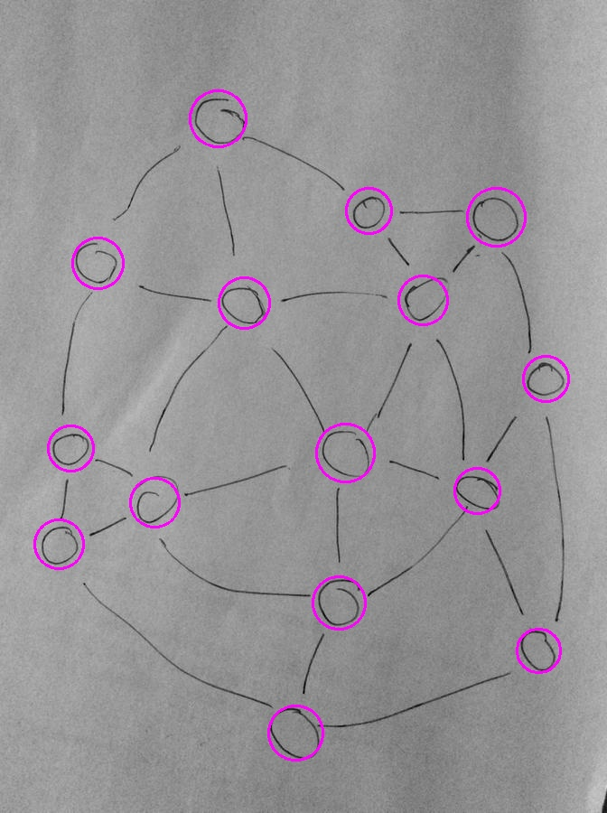

**Поиск начал линий**
=====================

Для того чтобы определить линию, необходимо знать:

-   Точку начала линии

-   Точку пересечения линии с другими

Поиск начал линий с помощью Каскадов Хаара
------------------------------------------

Изначально предлагалось использовать каскады для поиска начал линий.

#### **Статистика**


Лучший результат - это гистограмма, на которой наименьшее число 0 срабатываний.

#### **Результат:**


**Проблема:**
Любой шум, который есть на изображении (точка, иное множество пикселей)
может стать областью началом линии, поэтому число ложных срабатываний
оказалось достаточно велико. По этой причине пришлось отказаться от
данной идеи.

Поиск точек пересечения с помощью Каскадов Хаара
------------------------------------------------

Предполагалось использовать каскады для поиска пересечений.

#### **Статистика**
Проводилось сравнение с моделями для поиска начал линий.


#### **Результат:**


Использование каскадов не подходит из-за малой точности и большой
погрешности. Некоторый процент распознанных точек начал линий и точек
пересечений является ложным срабатыванием, поэтому точность еще ниже,
чем предполагалось.

Поиск начал линий с помощью Hough Lines
---------------------------------------

Используя алгоритм HoughLinesP из библиотеки OpenCV, удалось достичь очень хорошего результата, но у него есть один большой минус, который не позволил его использовать в данной задаче.

#### **Этапы алгоритма:**

1.  С помощью алгоритма Хаара и дополнительных фильтров определяем, где находятся вершины.

2.  Далее расширяем квадрат области с вершиной на среднее значение, вычисленное по среднему значению длины и ширины для данной области.

3.  Точки линий, обнаруженные алгоритмом HoughLinesP, которые находятсямежду квадратной областью Хаара и дополнительного квадрата, являются точками начала линий.

#### **Результат поиска начал линий:**


Сращивание маленьких линий с помощью Hough Lines
---------------------------------------

На основе алгоритма HoughLinesP была создана программа, которая позволяет
разбить линию после обработки алгоритмом Canny из OpenCV на маленькие
линии, чтобы потом срастить линии в одну.

Этапы программы на примере:

| 1) Обработанное изображение с доски     |       2) Алгоритм Canny |
| ------------- |:-------------:|
|       |     |
| 3)  Алгоритм HoughLinesP    |   4)  Алгоритм склеивания линий |
|   |    |

#### **Итог**
Данный метод безусловно эффективен для конкретного изображения, но для любого другого необходимо подбирать коэффициенты для склеивания линий.
Именно по этой причине эта программа не подошла.

### **Вывод**
Ни один из предложенных алгоритмов не подходит, поэтому был создан свой
алгоритм Tracker, который пробегается по пикселям линии. По этой причине
поиск начал линий было решено как пересечения вспомогательных квадратов
на основе размеров квадрата Хаара с пикселями линии графа - линий
движения умного ползунка (Tracker).

**Tracker**
===========

Поиск начал линий
-----------------

#### Этапы работы программы:

| 1) Обработанное изображение | 2) Алгоритм Canny |
| ------------- |:-------------:|
|  |  |
| 3) С помощью свертки соединяем 2 линии после алгоритма Canny  |  4) Уменьшаем размер линии до малого числа пискселей, чтобы не было разрыва |
|  |  |
| 5) То множество пикселей, которое попало в область дополнительных прямоугольников - удаляется  |  6) Белая часть - это множество точек пересечения, поэтому выбираем центральную точку пересечения для каждой области |
|  |  |
| 7) Получаем точки начал линий  |  8) После удаления в 5 пукте находим линии движения Tracker ("Умного ползунка") |
|  |  |

С помощью данного алгоритма мы можем «пройтись по линиям» графа.

Точка начала линий определяется с помощью дополнительных квадратов на
основе выделенной области Хаара.

#### Результат:


Движение Tracker
----------------

### Условие соединенности вершин
Для того, чтобы подтвердить, что линия принадлежит данным двум вершинам, необходимо, чтобы Tracker прошел от одной точки к другой, хотя бы один раз.

### Как двигается Tracker?
Движение основано на пересечении окружности с линией «дорогой» Tracker.


#### Алгоритм:
1.	На точке начала линии, рисуется красная окружность
2.	Находится ее пересечение с пикселями линии (дороги) Tracker
3.	Множество точек пересечения приводится к одной точке, в которой рисуется новая окружность (приведение к одной точке такое же как и у поиска начал линий)
4.	Циклически выполняем 2-3, до тех пор, пока не встретим:
  - Другую точку начала линии
  - Конец линии или окончание дороги


  Движение Tracker | Траектория движения Tracker
  ------------ | -------------
   | 

### Что происходит при различных выходах в пункте 4?
Включается прострел Tracker, который проверяет попадает ли линия в центр главного (красного) прямоугольника, который является границами распознанной вершины, используя координаты последних двух окружностей для построения прострела. Более подробно в главе про Tracker Shoot.

### Tracker Shoot
Данный алгоритм начинает работать после встречи одно из условий 4 пункта алгоритма движения Tracker.
Рассмотрим работу на примере.


Сверху на картинке изображен прострел для потверждения того, что линия приходит к вершине, а не уходит в сторону. Для прострела используется 2 координаты центра последних окружностей для построения линии и вычисления коэффициента k и b для рассчета.
- **Белая окружность** – точка начала линии.
- **Красная окружность** – последний шаг Tracker.
- При отсутствии белой окружности, т.е. точки начала линии, используется координаты 2 последних красных окружностей.


**Функция прямой: y=kx+b**

**Искомый коэффициент: k=(y-b)/x**

Используя координаты крайних точек главной области вершины (красный прямоугольник) и координату начала линии (в случае ее отсутсвия – последнюю красную окружность) определяем границы значения коэффициента k для прямой, которая должна попасть в область, где находится вершина.

Используя координаты центров белого и красного круга определяем функцию прямой, а затем искомый коэффициент.

Если коэффициент находится в допустимой области, то картинка будет такая же как слева.

### Основные проблемы и их решения
1.	При разрыве линии алгоритм движения Tracker может остановиться, т.к. попадет в провал точка пересечения окружности с траекторией Tracker.
  - [x] Решение – сделать динамическое расширение окружности на каждом шаге Tracker
2.	При пересечении линий алгоритм не работает, т.к. имеет много пересечений с траекторией Tracker
  - [x] Решение – сделать динамическое расширение окружности на каждом шаге Tracker
3.	Определение точек начала линии иногда дает плохой результат, если какая-либо линия проходит рядом с областью вершины (пример ниже).
  - [x] Решение – двойная верификация вершин, т.е. движение Tracker производится сначала в одну сторону, а потом в другую.

#### **Пример проблемы:**


Примеры
==========

Original image | Preprocessing | Vertex Search | Find Start | Tracker | Result
--- | --- | --- | --- | --- | ---
 |  |  |  |  | 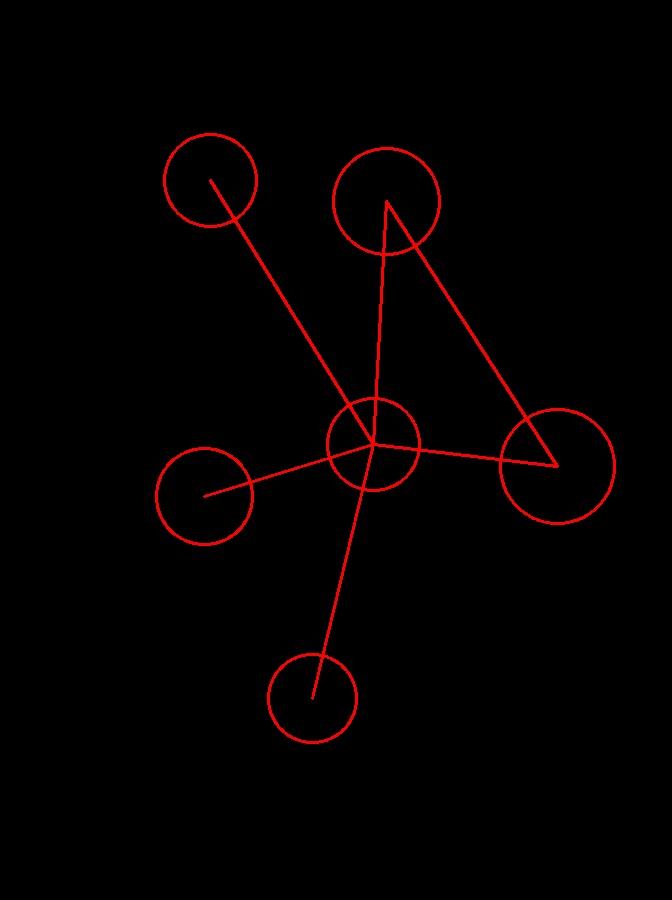
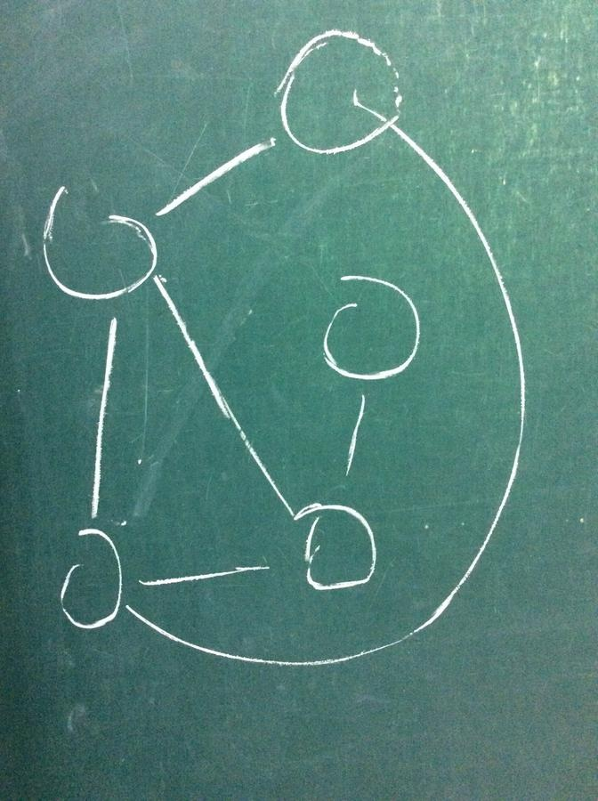 | 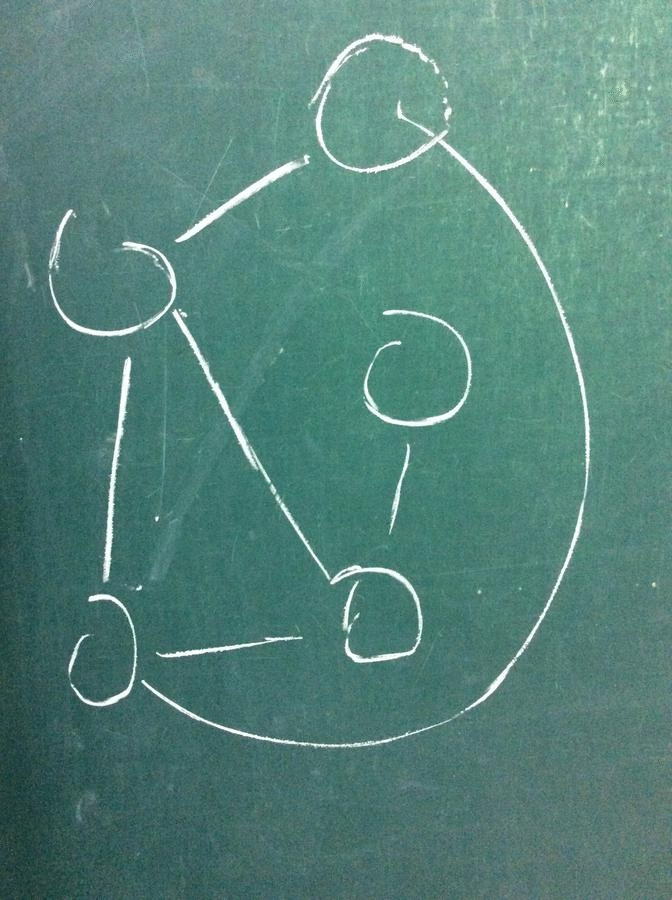 |  |  |  | 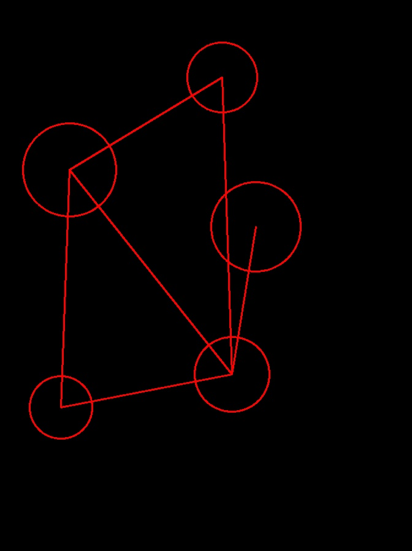
 |  | 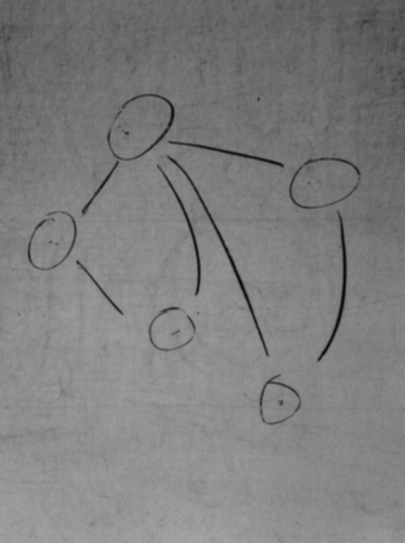 |  |  | 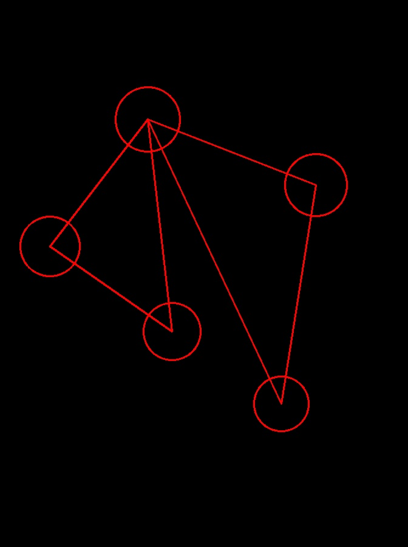
 |  |  | 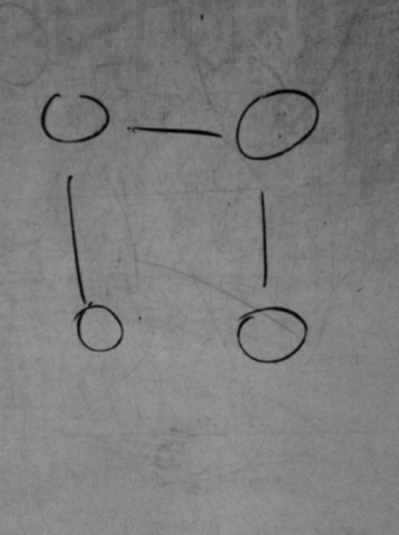 | 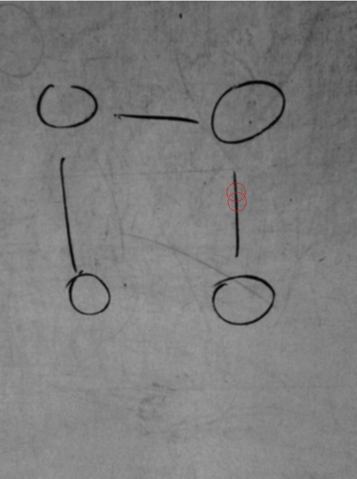 | 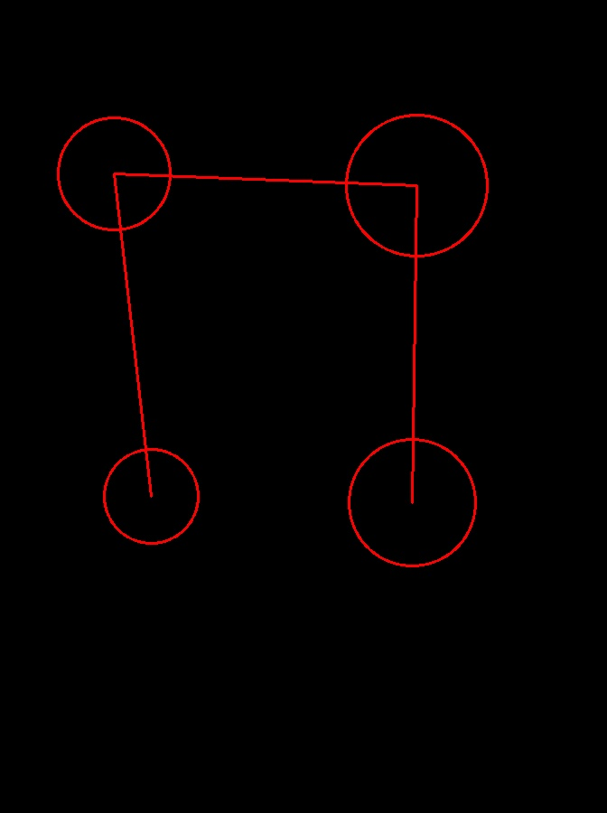
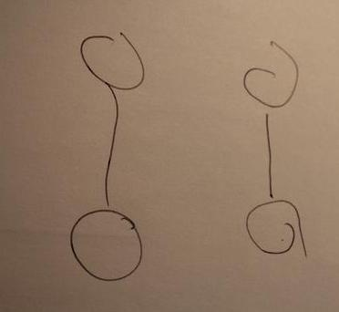 |  |  |  |  | 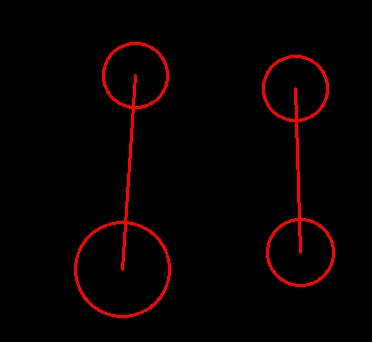

Литература
==========
1.	https://www.pyimagesearch.com/2017/08/21/deep-learning-with-opencv/
2.	https://habr.com/ru/post/309508/
3.	https://www.asozykin.ru/courses/nnpython-intro
4.	Курсы по нейронным сетям от Deep Learning Course при МФТИ
