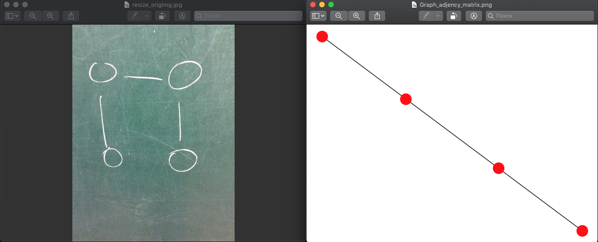
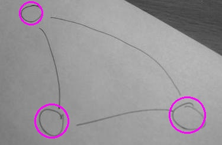
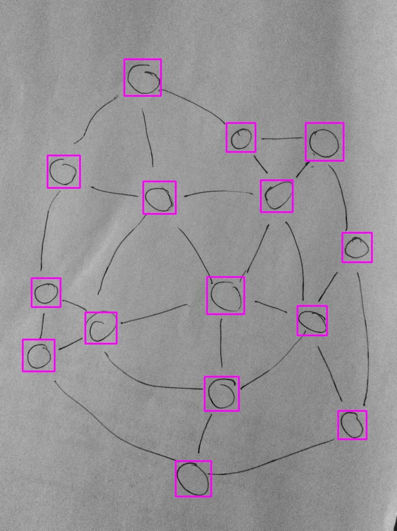

# Оцифровка графов
Автор: Ромакин Д.В.

Привет всем читателям Habrahabr!
В этой статье я хочу поделиться с вами своим первым проектом, связанным с компьютерным зрением. В нем стояла задача по изображению графа получать его матрицу смежости. Статья получилась объемной, поэтому решил разделить ее на 2 части. Первая часть будет полностью посвящена распознаванию вершин графа, а вторая - нахождению ребер графа.


## Краткое содержание
1. Распознавание вершин.
2. Нахождение ребер графа.
3. Алгоритм **Tracker** для поиска ребер.


## Результаты работы
Встала задача оцифроки графов - перевод изображения графа в вид пригодный для компьютерной обработки этого графа.

На вход алгоритму подается изображение графа, на выходе должна получиться матрица смежности. В статье для построения компьютерного изображения графа используется библиотека [NetworkX](https://networkx.github.io/). Но т.к. алгоритм строит матрицу смежности, можно использовать практически любую библиотеку для работы с графами.

На рисунках ниже приведен результат моей работы.
Слева исходные изображения графов, а справа компьютерное изображение, полученное после оцифровки.



## Описание системы
Программа разбита в несколько этапов:

1. На вход поступает изображение.
2. Запускается скрипт для подготовки данных (удаление шумов и инвертирование цветов в 1 канал).
3. Поиск вершин VertexSearch. На изображении с помощью каскадов Хаара ищем вершины графа, затем запускаем фильтрацию, которая позволяет уменьшить количество ошибок от каскадов.
4. Поиск ребер EdgeSearch. Определяем координаты пересечения ребер и вершин.
5. Алгоритм **Tracker**. Находим ребра и какие вершины эти ребра соединяют.
6. Составляется удобный формат для дальнейшей визуализации.

### Визуализация полного цикла работы
Ниже можно увидеть работу всех стадий оцифровки графа.


## Подготовка данных
Подготовка данных - это простой, но в тоже время важный шаг в работе системы.

Для работы системы входное изображение надо нормировать, перевести изображение в один канал и по возможности убрать шумы. Задача стояла оцифровывать графы, которые избражены белым на темном фоне (мелом на доске) и, наоборот, темной ручкой на светлом фоне (графы нарисованные ручкой в тетраде). Поэтому пришлось делать два варианта подготовки данных:

- green -- темный фон;
- white -- светлый фон.

Подготовка данных заключается в следующем:
1. Уменьшаем изображение так, чтобы длина и ширина были меньше, чем 900 пикселей, сохраняя пропорции.
2. Перевод в 1 канал
3. В зависимости от типа изображения (green/white) инвертируем цвета, чтобы выделить контур графа черным цветом.


## Поиск вершин графа - Vertex Search
Подготовленное на предыдущем шаге изображение подается на вход алгоритму, который состоит из несколько шагов:

1. Поиск кандидатов с помощью [каскадов Хаара](https://habr.com/ru/company/recognitor/blog/228195/).
2. Фильтр, основанный на сверточной нейронной сети.
3. Дополнительный фильтр пересечений.

Два последних шага используются для предотвращения ошибок, которые совершили каскады.


### Каскады Хаара

Для поиска окружностей рассматривалаись 4 алгоритма:

1. Simple Blob Detector ([example](https://www.learnopencv.com/blob-detection-using-opencv-python-c/), [documentation](https://docs.opencv.org/3.4.3/d0/d7a/classcv_1_1SimpleBlobDetector.html))
2. MSER Blob Detector ([example](http://qaru.site/questions/2443082/merge-mser-detected-objetcs-opencv-python), [documentation](https://docs.opencv.org/2.4/modules/features2d/doc/feature_detection_and_description.html?highlight=mser))
3. Hough Circles ([example](https://www.pyimagesearch.com/2014/07/21/detecting-circles-images-using-opencv-hough-circles/), [documentation](https://opencv-python-tutroals.readthedocs.io/en/latest/py_tutorials/py_imgproc/py_houghcircles/py_houghcircles.html))
4. Каскады Хаара

Первые 2 варианта не подошли из-за маленького числа распознанных вершин при тестировании.
Алгоритм Hough Circles может конкурировать с каскадами, но ему требуется уникальная настройка параметров для каждого изображения.
По этим причинам были выбраны Каскады Хаара.

#### Получение обучающей выборки
Для успешного обучения каскадов Хаара потребуется большое количество «отрицательных» и «положительных» образцов.
Для удобной разметки изображений используется разработанная программа, которая позволяет получить изображения вершин графа, путем выделения нужной области на изображении.
Также эта утилита позволяет сформировать индексный файл для дальнейшего обучения каскадов Хаара.
Для расширения обучающего набора я сгенерировал дополнительные данные путем поворота исходных изображений на произвольный угол (от 0 до 180 градусов).

Программу для получения вершин графа и индексного файла можно найти в [репозитории](https://github.com/Dmitriy1594/NeiroGraphDetect/tree/Steps-of-project/Dataset/markup).
[Рядом](https://github.com/Dmitriy1594/NeiroGraphDetect/tree/Steps-of-project/Dataset/refactor_dataset) можно также найти программу для генерации дополнительного набора.

#### Обучение признаков Хаара
Информацию о том как обучить каскады Хаара локально у себя на компьюторе можно найти [тут](https://habr.com/ru/post/208092/), [тут](https://docs.opencv.org/3.3.0/dc/d88/tutorial_traincascade.html) и [тут](https://medium.com/@a5730051/train-dataset-to-xml-file-for-cascade-classifier-opencv-43a692b74bfe).
Я обучал различные модели Хаара в "облаке" [Google Cloud Platform](https://cloud.google.com).

Каскады Хаара обучались долго из-за того, что обучал на CPU. Подключить GPU для этой цели у меня не получилось, буду благодарен, если поделитесь в комментариях инструкциями, как ипользовать GPU для обучения каскадов.

#### Выбор обученной модели Хаара
После обучения нескольких моделей настало время выбрать лучшую. Для этого просто найдем модель, которая дает наименьшую ошибку на тестовых данных.

В ходе тестирования было создано сводное изображение всех диаграмм для каждой модели каскада Хаара, которое можно увидеть ниже. Диаграммы показывают зависимость количества фотографий от числа вершин.


Видно, что минимальное число ложных срабатываний (число нераспознанных вершин) имеет каскад Хаара 20x20 2 типа.

### Фильтр сверточной нейронной сети
Каскады Хаара иногда ошибочно выделяют области изображений на которых нет вершин. Такие случаи необходимо свести к минимуму. Для этого я использовал сверточную нейронную сеть. Задача сверточной нейронной сети (СНС) - убедиться, что на области, которую выявили каскады, есть  вершина графа.

#### Архитектура сети
За основу архитектуры нейронной сети была взята сверточная нейронная сеть LeNet5:


Так как форма вершин графа простая, то для измененной архитектуры СНС число features maps на каждом этапе свертки примерно такое же, как и для различных букв алфавита, которые используется для обучения нейронной сети на изображении.

В результате экспериментов была найдена оптимальная архитектура СНС:


На выходе два нейрона, которые дают вероятностную оценку вершина или не вершина.

Код для обучения СНС:
```python
# LeNet architecture
def build(width, height, depth, classes):
    # initialize the model
    model = Sequential()
    inputShape = (height, width, depth)

    # if we are using "channels first", update the input shape
    if K.image_data_format() == "channels_first":
        inputShape = (depth, height, width)

    # first set of CONV => RELU => POOL layers
    model.add(Convolution2D(20, (5, 5), activation='relu',
                            input_shape=(height, width, depth)))

    model.add(MaxPooling2D(pool_size=(2, 2), strides=(2, 2)))

    # second set of CONV => RELU => POOL layers
    model.add(Convolution2D(50, (5, 5), activation='relu'))
    # model.add(Activation("relu"))
    model.add(MaxPooling2D(pool_size=(2, 2), strides=(2, 2)))

    # first (and only) set of FC => RELU layers
    model.add(Flatten())
    model.add(Dense(500, activation='relu'))
    model.add(Dropout(0.5))

    # softmax classifier
    model.add(Dense(classes))
    model.add(Activation("softmax"))

    # return the constructed network architecture
    return model

# initialize the number of epochs to train for, initialize learning rate,
# and batch size
EPOCHS = 27
INIT_LR = 1e-3
BS = 32

...

# partition the data into training and testing splits using 75% of
# the data for training and the remaining 25% for testing
(trainX, testX, trainY, testY) = train_test_split(data,
labels, test_size=0.25, random_state=42)

# convert the labels from integers to vectors
trainY = to_categorical(trainY, num_classes=2)
testY = to_categorical(testY, num_classes=2)

# construct the image generator for data augmentation
aug = ImageDataGenerator(rotation_range=30, width_shift_range=0.1,
height_shift_range=0.1, shear_range=0.2, zoom_range=0.2,
horizontal_flip=True, fill_mode="nearest")

# initialize the model
print("[INFO] compiling model...")
model = build(width=28, height=28, depth=3, classes=2)
opt = Adam(lr=INIT_LR, decay=INIT_LR / EPOCHS)
# SGD(momentum=0.9)
model.compile(optimizer=opt, loss='binary_crossentropy', metrics=["accuracy"])

# train the network
print("[INFO] training network...")
H = model.fit_generator(aug.flow(trainX, trainY, batch_size=BS),
validation_data=(testX, testY), steps_per_epoch=len(trainX) // BS,
epochs=EPOCHS, verbose=1)
```

#### Результаты обучения сверточной сети


### Дополнительный фильтр пересечений
Бывали редкие случаи, когда каскады Хаара и СНС одну вершину принимали за несколько.
Чтобы избавиться от этого дефекта, используется дополнительный фильтр.


### Vertex Search
Ниже можно увидеть, как работают все этапы поиска вершин.

Каскад Хаара | Фильтр СНС | Результат
--- | --- | ---
  |    |  
  |    |  

Если есть желание, то можно протестировать модель каскадов Хаара и фильта СНС можно с помощью следующего кода:
```python
def neural_network_2828(image, modelnn):
    # copy image
    orig = image.copy()
    
    # pre-process the image for classification
    image = cv2.resize(image, (28, 28))
    image = image.astype("float") / 255.0
    image = img_to_array(image)
    image = np.expand_dims(image, axis=0)
    
    # load the trained convolutional neural network
    print("[INFO] loading network...")
    model = load_model(modelnn)    # modelnn - path to your model
    
    # classify the input image
    (notVertex, vertex) = model.predict(image)[0]
    
    # build the label and return it
    label = "Vertex" if vertex > notVertex else "Not Vertex"
    proba = vertex if vertex > notVertex else notVertex
    return (label, round(proba * 100, 2), str(float("{0:.2f}".format(proba * 100))))


def haartest(image_path):
    # This is the cascade we just made.
    cascade = cv2.CascadeClassifier('./PATH/TO/YOUR/cascade.xml')
    
    # read image
    img = cv2.imread(image_path)
    # copy image
    img_c = img.copy()
    # filter cvtColor
    gray = cv2.cvtColor(img_c, cv2.COLOR_BGR2GRAY)
    
    # Haar detecting results save to variable vertex
    vertex = cascade.detectMultiScale(gray)
    
    # get rectangle from variable vertex
    for (x, y, w, h) in vertex:
        
        # crop the vertex from image
        crop_img = img[y:y + h, x:x + w]
        # load to neural network function to get the label with % classification
        label = neural_network_2828(crop_img)
        
        # put text
        if (label[0] == "Vertex"):
            
            # draw rectangle
            cv2.rectangle(img, (x, y), (x + w, y + h), (255, 0, 255), 2)
            
            # choose font
            font = cv2.FONT_HERSHEY_SIMPLEX
            # put the text: Vertex + % of confidence
            cv2.putText(img, 'V'+label[2], (x - 2, y - 2),
                        font, 0.5, (255, 0, 255), 1, cv2.LINE_AA)
            
        else:
            
            # draw rectangle
            cv2.rectangle(img, (x, y), (x + w, y + h), (0, 255, 0), 2)
            
            # choose font
            font = cv2.FONT_HERSHEY_SIMPLEX
            # put the text: Not Vertex + % of confidence
            cv2.putText(img, 'NV'+label[2], (x - 2, y - 2),
                        font, 0.5, (0, 255, 0), 1, cv2.LINE_AA)

    # save image
    x = image_path.split("/")    # image name save to variable to x
    path = './PATH/TO/SAVE/YOUR/IMAGE/'
    cv2.imwrite(path + x[-1], img)
    return img
```

А здесь видно, как помогает дополнительный фильтр пересечений.


## Заключение
Надеюсь, что эта часть статьи была полезна читателям Хабра. В следующей части статьи речь пойдет об определении ребер графа - Edge Search.

## Литература
1.  https://www.pyimagesearch.com/2017/08/21/deep-learning-with-opencv/
2.  https://www.pyimagesearch.com/category/object-detection/
2.	https://habr.com/ru/post/309508/
3.  https://habr.com/ru/post/312450/
3.	https://www.asozykin.ru/courses/nnpython-intro
4.	https://proglib.io/p/neural-nets-guide/

## Github
[Мой Github](https://github.com/Dmitriy1594/NeiroGraphDetect)
