# Курсовой проект
Оцифровка графов
=================
Привет всем читателям Habrahabr, в этой статье я хочу поделиться с Вами своим первым проектом, который посвящен оцифровке неориентированных графов. Данная тема "на пальцах" освещается весьма плохо.

## Результаты работы
В результате работы алгоритма получается матрица смежности. Далее она используется для компьютерного отображения графа.

На вход подается изображение с графом, нарисованным
- на доске (слева), результат - справа


- на бумаге (слева), результат - справа

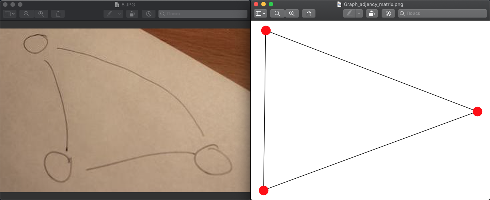

Описание работы системы
=================


Программа разбита в несколько этапов:

1.  На вход поступает изображение форматом .png .jpg .jpeg и др. и
    запускается скрипт с предобработкой (удаление шумов и инвертирование
    цветов в 1 канал).

2.  VS: На изображении с помощью каскадов Хаара ищем вершины графа,
    затем запускаем фильтрацию в 2 этапа (СНС и дополнительный
    алгоритмический фильтр), сохраняем полученные данные файл для
    следующего этапа.

3.  ES: Определяем начало движения Tracker* у каждой вершины графа с
    помощью дополнительных прямоугольников.

4.  ES: Запускаем Tracker* для определения какие вершины соединены.

5.  Составляется удобный формат для дальнейшей визуализации.

P.s. Tracker* - собственное название разработанного алгоритма.

### Визуализация полного цикла работы
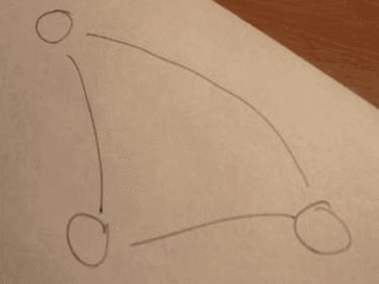

Подготовка данных
=================

Подготовка данных - это маленький, но значимый шаг в алгоритме работы системы.

### Как работает

Изображение подается на вход с префиксом green/white:

1.  Если изображение больше, чем 900 пикселей в ширине или высоте, то
    уменьшаем размер до 900x900 (размер на высоте или ширине должен быть
    меньше или равен 900). Если изображение не квадратное, то сохраняя
    пропорции уменьшаем самую большую сторону до 900.

2.  Green - изображение с доски. Этапы: переводим в 1 канал, убираем
    шумы и инвертируем цвета (чтобы выделить черным контур графа)

3.  White - изображение с листка бумаги. Этапы: переводим в 1 канал.


Поиск вершин графа (Vertex Search)
======================

Подготовленное изображение подается на алгоритм, который состоит из
несколько шагов:

1.  [Каскады Хаара](https://habr.com/ru/company/recognitor/blog/228195/)

2.  Фильтр, реализованный с помощью сверточной нейронной сети

3.  Алгоритмический фильтр

**Каскады Хаара**
-----------------

### **Почему каскады Хаара?**

Для поиска окружностей рассматривалаись 3 алгоритма:
1.  Simple Blob Detector ([example](https://www.learnopencv.com/blob-detection-using-opencv-python-c/), [documentation](https://docs.opencv.org/3.4.3/d0/d7a/classcv_1_1SimpleBlobDetector.html))
2.  MSER Blob Detector ([example](http://qaru.site/questions/2443082/merge-mser-detected-objetcs-opencv-python), [documentation](https://docs.opencv.org/2.4/modules/features2d/doc/feature_detection_and_description.html?highlight=mser))
3.  Hough Circles ([example](https://www.pyimagesearch.com/2014/07/21/detecting-circles-images-using-opencv-hough-circles/), [documentation](https://opencv-python-tutroals.readthedocs.io/en/latest/py_tutorials/py_imgproc/py_houghcircles/py_houghcircles.html))

Первые 2 не подошли из-за маленького числа распознанных вершин при тестировании, а последний алгоритм может конкурировать с каскадами, но ему требуется уникальные коэффициенты, которые подходят для данного изображения.

#### Основа каскада Хаара
В основе каскадов Хаара из библиотеки OpenCV лежит метод Виолы-Джонса (Viola-Jones)(чаще всего его используют для распознавания лиц), который основывается на следующих принципах:
1. используются изображения в [интегральном представлении](https://en.wikipedia.org/wiki/Summed-area_table), что позволяет вычислять быстро необходимые объекты;
2. используются [признаки Хаара](https://en.wikipedia.org/wiki/Haar-like_feature), с помощью которых происходит поиск нужного объекта;
3. используется [boost](http://machinelearning.ru/wiki/index.php?title=Бустинг) (от англ. boost – улучшение, усиление) для выбора наиболее подходящих признаков для искомого объекта на данной части изображения;
4. все признаки поступают на вход [классификатора](https://ru.wikipedia.org/wiki/Задача_классификации), который даёт результат «верно» либо «ложь»;
5. используются каскады признаков для быстрого отбрасывания окон, где не найден искомый объект.

Ссылка: [Подробное описание про каждый признак](https://habr.com/ru/post/133826/)


### **Подготовка данных**

Все разработанные программы применялись для создания датасета для обучения каскадов Хаара.

#### **Программа для создания набора данных для обучения**

Для успешного обучения потребуется большое количество «отрицательных» и
«положительных» образцов. Для более удобной разметки изображений
используется разработанная программа, которая позволяет получить
изображения вершин графа, путем выделения нужной области в ходе работы
программы.

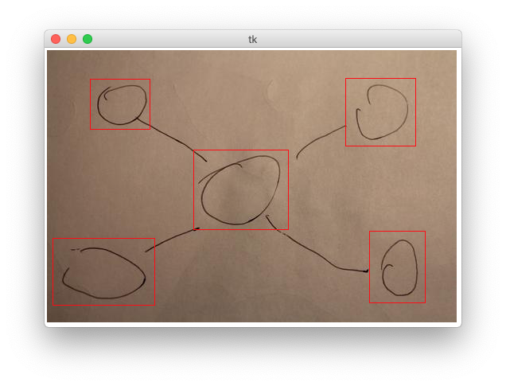

#### **Пример данных для обучения:**
Также с помощью программы можно сформировать индексный файл с расширением .dat для дальнейшего обучения каскадов Хаара (фотография выше).

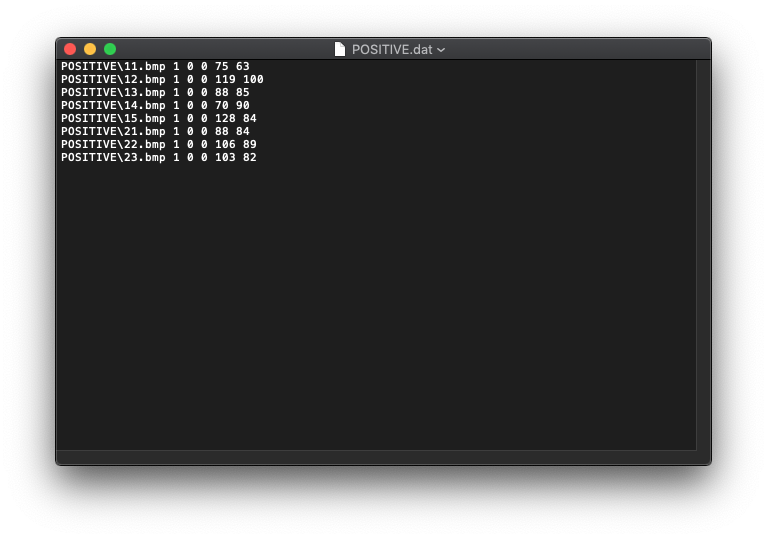

#### **Программа для генерации дополнительного набора данных для обучения**


При малом количестве изображений можно сгенерировать дополнительные наборы данных путем поворота их на определенный угол, который задается перед запуском, или на произвольный угол (от 0 до 180 градусов).

### **Обучение признаков Хаара**

#### **Визуализация обучения каскада Хаара**
Фичи, которые выделяет каскад при обучении можно увидеть, используя следующий скрипт: (подробнее: [тут](https://docs.opencv.org/3.3.0/dc/d88/tutorial_traincascade.html))
```
opencv_visualisation --image=/data/object.png --model=/data/model.xml --data=/data/result/
```
**Пример обучения каскадов с визуализацией**

[](http://www.youtube.com/watch?v=hPCTwxF0qf4 "Визуализация обучения каскадов Хаара")

#### **Кратко об обучении каскадов Хаара на облачном ресурсе**
Информацию о том как обучить каскады Хаара локально у себя на компьюторе можно найти [тут](https://habr.com/ru/post/208092/), [тут](https://docs.opencv.org/3.3.0/dc/d88/tutorial_traincascade.html) и [тут](https://medium.com/@a5730051/train-dataset-to-xml-file-for-cascade-classifier-opencv-43a692b74bfe).
Обучение различных моделей Хаара производилось на [GCP](https://cloud.google.com), на виртуальной машине Ubuntu 16.04 LTS.

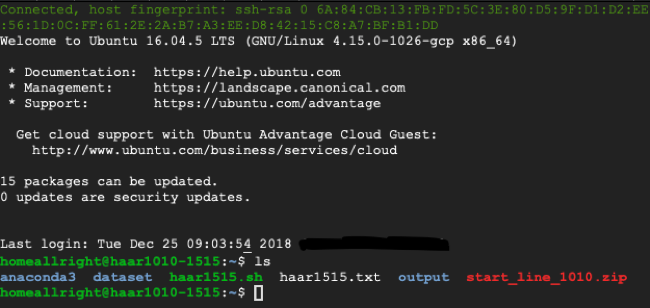

Обучение каскадов осуществлялось следующим образом: с помощью данной консоли запускали скрипт **haar1515.sh**, который запускал обучение. В этом файле прописаны команды для запуска обучения, фото ниже:


Скрипт запускается в deamon процессе с записью в .txt:
```
$ nohup ./haar1515.sh \>\$HOME/haar1515.txt 2\>&1 \< /dev/null &
```

Для отслеживания аппаратных ресурсов и прогресса применялась старая добрая утилита
**htop**. C помощью нее определил, что программа для обучения из библиотеки OpenCV не выделяет память в указанном размере в скрипте **haar1515.sh**, поэтому ждать пришлось достаточно долго.

Конечный результат вывода в файл **haar1515.txt** (последняя стадия обучения)

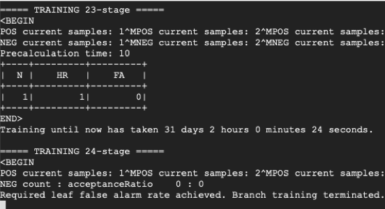

Каскады Хаара обучал на CPU. Поиск для обучения на GPU ничего не дал, буду благодарен за пруфы в комментариях.
В данном случае 23 стадия обучалась 31 день. Это не предел, поэтому каскады Хаара обучались не более, чем на **25 эпохах**, используя **8 ядер** и не менее **40 Гб** оперативной памяти.

### **Выбор обученной модели Хаара**
#### Как выбирается лучший каскад?
1. Создаем файл csv для дальнейшего его анализа c помощью библиотеки pandas и seaborn
2. Анализируем данные, строим диаграммы для каждой модели
3. Выбираем самый оптимальный

##### Диаграммы
Проанализируем каждый каскад в целом с помощью диаграмм:


**С помощью диаграммы находим, что
минимальное число ложных срабатываний (число нераспознанных вершин)
имеет каскад Хаара 20x20 2 типа.**

**Отсюда делаем вывод:**
Лучшая обученная модель каскадов - Хаар 20x20 2 типа:


**Фильтр СНС**
--------------
Из-за того, что каскады Хаара иногда выделяют пересечения линий, похожие на вершину графа, то данные случаи необходимо свести к минимуму с помощью сверточной нейронной сети. Задача СНС (Сверточной Нейронной Сети) - классификация вершин.

О том как работает свертка в изображении можно найти в моем репозитории в ветке Steps-of-project: [Ccылка](https://github.com/Dmitriy1594/NeiroGraphDetect/tree/Steps-of-project/Image%20processing/Convolutional-Layers)
Подробнее о том, что такое сверточная нейронная сеть - [ссылка](https://habr.com/ru/post/348000/)

#### Архитектура
**За основу архитектуры нейронной сети была
взята сверточная нейронная сеть LeNet5:**


Так как вершина графа является кругом, то для измененной архитектуры СНС число features maps на каждом этапе свертки примерно такое же, как и для различных букв алфавита, которые используется для обучения нейронной сети на изображении.

**В результате многочисленных экспериментов
была найдена оптимальная архитектура СНС:**


На выходе два нейрона, которые дают вероятностную оценку вершина или не вершина в %.

#### **Скрипт для обучения СНС**
```python
  # LeNet architecture
  def build(width, height, depth, classes):
  	# initialize the model
  	model = Sequential()
  	inputShape = (height, width, depth)

  	# if we are using "channels first", update the input shape
  	if K.image_data_format() == "channels_first":
  		inputShape = (depth, height, width)

  	# first set of CONV => RELU => POOL layers
  	model.add(Convolution2D(20, (5, 5), activation='relu',
  							input_shape=(height, width, depth)))

  	model.add(MaxPooling2D(pool_size=(2, 2), strides=(2, 2)))

  	# second set of CONV => RELU => POOL layers
  	model.add(Convolution2D(50, (5, 5), activation='relu'))
  	# model.add(Activation("relu"))
  	model.add(MaxPooling2D(pool_size=(2, 2), strides=(2, 2)))

  	# first (and only) set of FC => RELU layers
  	model.add(Flatten())
  	model.add(Dense(500, activation='relu'))
  	model.add(Dropout(0.5))

  	# softmax classifier
  	model.add(Dense(classes))
  	model.add(Activation("softmax"))

  	# return the constructed network architecture
  	return model

  # initialize the number of epochs to train for, initialize learning rate,
  # and batch size
  EPOCHS = 27
  INIT_LR = 1e-3
  BS = 32

  ...

  # partition the data into training and testing splits using 75% of
  # the data for training and the remaining 25% for testing
  (trainX, testX, trainY, testY) = train_test_split(data,
  	labels, test_size=0.25, random_state=42)

  # convert the labels from integers to vectors
  trainY = to_categorical(trainY, num_classes=2)
  testY = to_categorical(testY, num_classes=2)

  # construct the image generator for data augmentation
  aug = ImageDataGenerator(rotation_range=30, width_shift_range=0.1,
  	height_shift_range=0.1, shear_range=0.2, zoom_range=0.2,
  	horizontal_flip=True, fill_mode="nearest")

  # initialize the model
  print("[INFO] compiling model...")
  model = build(width=28, height=28, depth=3, classes=2)
  opt = Adam(lr=INIT_LR, decay=INIT_LR / EPOCHS)
  # SGD(momentum=0.9)
  model.compile(optimizer=opt, loss='binary_crossentropy', metrics=["accuracy"])

  # train the network
  print("[INFO] training network...")
  H = model.fit_generator(aug.flow(trainX, trainY, batch_size=BS),
  	validation_data=(testX, testY), steps_per_epoch=len(trainX) // BS,
  	epochs=EPOCHS, verbose=1)
```

#### **Результаты обучения СНС**


#### Лучший результат:

**С учетом экспериментов лучше всего себя показала модель vertex_sort.model.**
Было использовано 15 фото для анализа фильтра, основанный на нейронной сети. Общее затраченное время на анализ моделей: 4,5 часа. Следовательно, фильтрация, основанная на нейронной сети - дорогостоящая операция, но результативная, т.к. на случайных данных 40% фото были доведены до идеала (идеал - когда на фото были распознаны все вершины).

**Дополнительный фильтр пересечений**
-------------------------------------
**Данный фильтр позволяет избавится от некоторых случаев пересечения:**


**Слева** - пересечение, которое вычислил алгоритм, а **справа** - результат.
Все подобные случаи пересечения учитываются при выполнения работы.

**Как это выглядит динамически:**


Результат работы каскада Хаара
-------------------------------------
Каскад Хаара | Фильтр СНС | Результат
--- | --- | ---
  | 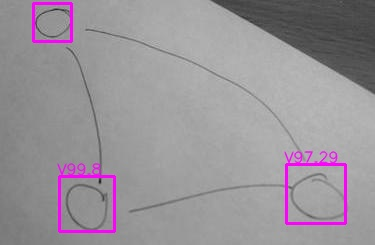   |  
  |    |  


Поиск начал линий (Edge Search)
=====================

Для того чтобы определить линию, необходимо знать:

-   Точку начала линии

-   Точку пересечения линий

Было сделано несколько вариантов:

Поиск начал линий | Результат | Поиск пересечений линий | Результат
--- | --- | --- | ---
Каскады Хаара | Любой шум, который есть на изображении (точка, иное множество пикселей) может стать областью началом линии, поэтому число ложных срабатываний оказалось достаточно велико. По этой причине пришлось отказаться от данной идеи. | Каскады Хаара | Использование каскадов не подходит из-за малой точности и большой погрешности. Некоторый процент распознанных точек начал линий и точек пересечений является ложным срабатыванием, поэтому точность еще ниже, чем предполагалось.
Hough Lines |  Используя алгоритм HoughLinesP из библиотеки OpenCV, удалось достичь очень хорошего результата, но у него есть один большой минус, который не позволил его использовать в данной задаче - уникальные коэффициенты.  | Сращивание маленьких линий с помощью Hough Lines |  На основе алгоритма HoughLinesP была создана программа, которая позволяет разбить линию после обработки алгоритмом Canny из OpenCV на маленькие линии, чтобы потом срастить линии в одну. 


### Вывод
Ни один из предложенных алгоритмов не подходит, поэтому был создан свой Tracker, который пробегается по пикселям линии. По этой причине поиск начал линий было решено как пересечения вспомогательных квадратов на основе размеров квадрата Хаара с пикселями линии графа - линий движения умного ползунка (Tracker).

Tracker
===========
Поиск начал линий
-----------------
#### Этапы работы программы:

| 1) Обработанное изображение | 2) Алгоритм Canny |
| ------------- |:-------------:|
|  |  |
| 3) С помощью свертки соединяем 2 линии после алгоритма Canny  |  4) Уменьшаем размер линии до малого числа пискселей, чтобы не было разрыва |
|  |  |
| 5) То множество пикселей, которое попало в область дополнительных прямоугольников - удаляется  |  6) Белая часть - это множество точек пересечения, поэтому выбираем центральную точку пересечения для каждой области |
| 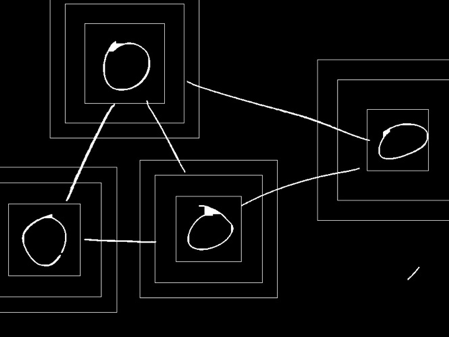 |  |
| 7) Получаем точки начал линий  |  8) После удаления в 5 пукте находим линии движения Tracker ("Умного ползунка") |
| 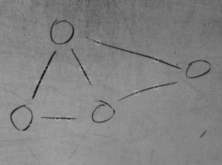 |  |

С помощью данного алгоритма мы можем «пройтись по линиям» графа.

Точка начала линий определяется с помощью дополнительных квадратов на
основе выделенной области Хаара.

#### Результат:


Движение Tracker
----------------
### Условие соединенности вершин
Для того, чтобы подтвердить, что линия принадлежит данным двум вершинам, необходимо, чтобы Tracker прошел от одной точки к другой, хотя бы один раз.

### Как двигается Tracker?
Движение основано на пересечении окружности с линией «дорогой» Tracker.


#### Алгоритм:
1.	На точке начала линии, рисуется красная окружность
2.	Находится ее пересечение с пикселями линии (дороги) Tracker
3.	Множество точек пересечения приводится к одной точке, в которой рисуется новая окружность (приведение к одной точке такое же как и у поиска начал линий)
4.	Циклически выполняем 2-3, до тех пор, пока не встретим:
  - Другую точку начала линии
  - Конец линии (окончание дороги)


  Движение Tracker | Траектория движения Tracker
  ------------ | -------------
   | 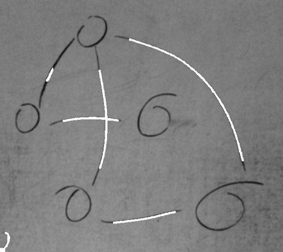

### Что происходит при различных выходах в пункте 4?
Включается прострел Tracker, который проверяет попадает ли линия в центр главного (красного) прямоугольника, который является границами распознанной вершины, используя координаты последних двух окружностей для построения прострела. Более подробно в главе про Tracker Shoot.

### Tracker Shoot
Данный алгоритм начинает работать после встречи одно из условий 4 пункта алгоритма движения Tracker.
Рассмотрим работу на примере.

Tracker Shoot | Tracker Shoot Zoom
------------ | -------------
 | 

Сверху слева на картинке изображен прострел для потверждения того, что линия приходит к вершине, а не уходит в сторону. Для прострела используется 2 координаты центра последних окружностей для построения линии и вычисления коэффициента k и b для рассчета.
- **Белая окружность** – точка начала линии.
- **Красная окружность** – последний шаг Tracker.
- При отсутствии белой окружности, т.е. точки начала линии, используется координаты 2 последних красных окружностей для построения прострела.

Функция прямой: y=kx+b, следовательно: искомый коэффициент: k=(y-b)/x
Используя координаты вершин красного прямоугольника и координату начала линии (в случае ее отсутсвия – последнюю красную окружность) определяем границы значения коэффициента k для прямой, которая должна попасть в область, где находится вершина.
Используя координаты центров белого и красного круга определяем функцию прямой, а затем искомый коэффициент.
Если коэффициент находится в допустимой области, то картинка будет такая же как в таблице сверху.

Проблемы
==========
### Основные проблемы
1.	При разрыве линии алгоритм движения Tracker может остановиться, т.к. в провал попадет точка пересечения окружности с траекторией Tracker.
2.	При пересечении линий алгоритм не работает, т.к. имеет много пересечений с траекторией Tracker

####  Пример проблемы:


3.	Определение точек начала линии иногда дает плохой результат, если какая-либо линия проходит рядом с областью вершины (пример ниже).

####  Пример проблемы:

Original image -> Preprocessing | Vertex Search with action | Find Start | Tracker | Result
--- | --- | --- | --- | ---
 |  |  |  | 

4. Для корректной работы нужно указывать индекс для фотографии, которая поступает на вход.
5. Отсутсвие многопоточности, для поиска вершин и Tracker.

Примеры
==========
### Положительный результат
Original image -> Preprocessing | Vertex Search | Find Start | Tracker | Result
--- | --- | --- | --- | ---
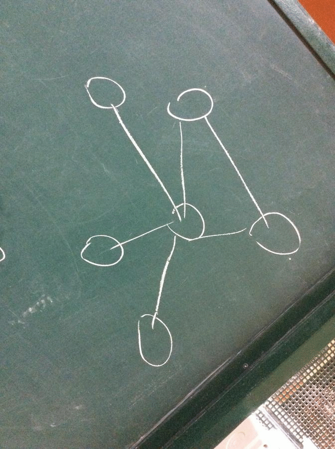 |  |  |  | 
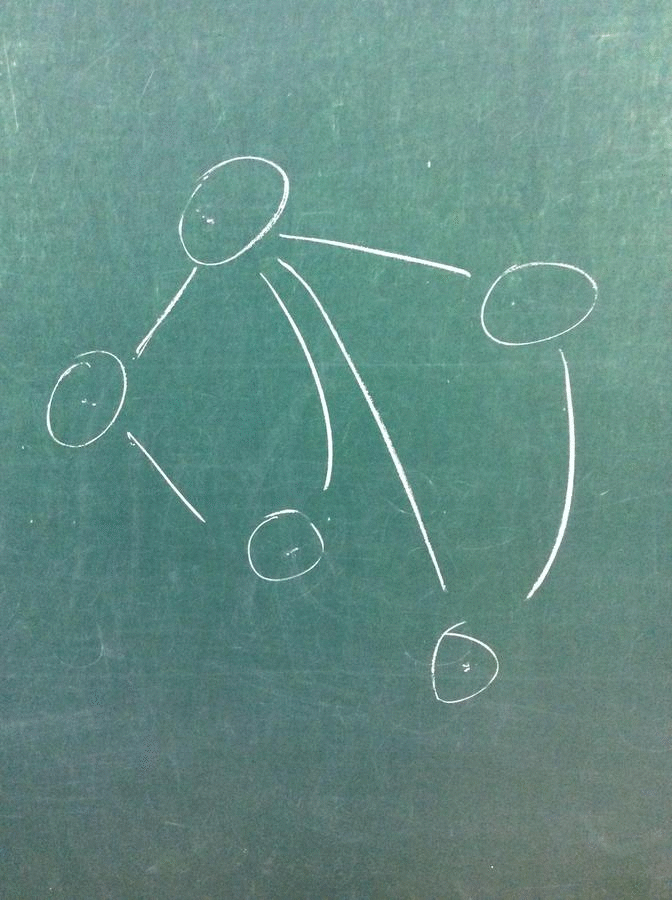 |  |  |  | 
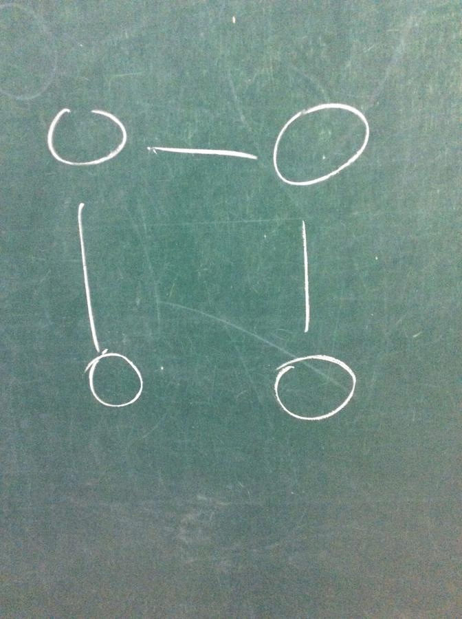 |  |  |  | 

###  Пример, где активируется дополнительный фильтр пересечений:
Original image -> Preprocessing | Vertex Search with action | Find Start | Tracker | Result
--- | --- | --- | --- | ---
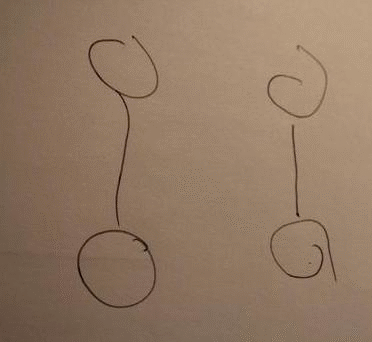 |  |  | 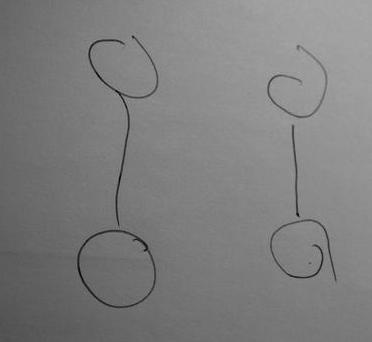 | 


Литература
==========
1.  https://www.pyimagesearch.com/2017/08/21/deep-learning-with-opencv/
2.  https://www.pyimagesearch.com/category/object-detection/
2.	https://habr.com/ru/post/309508/
3.  https://habr.com/ru/post/312450/
3.	https://www.asozykin.ru/courses/nnpython-intro
4.	https://proglib.io/p/neural-nets-guide/

Github
==========
[Мой Github](https://github.com/Dmitriy1594/NeiroGraphDetect)
