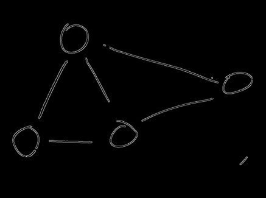
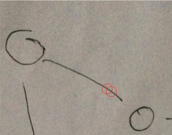
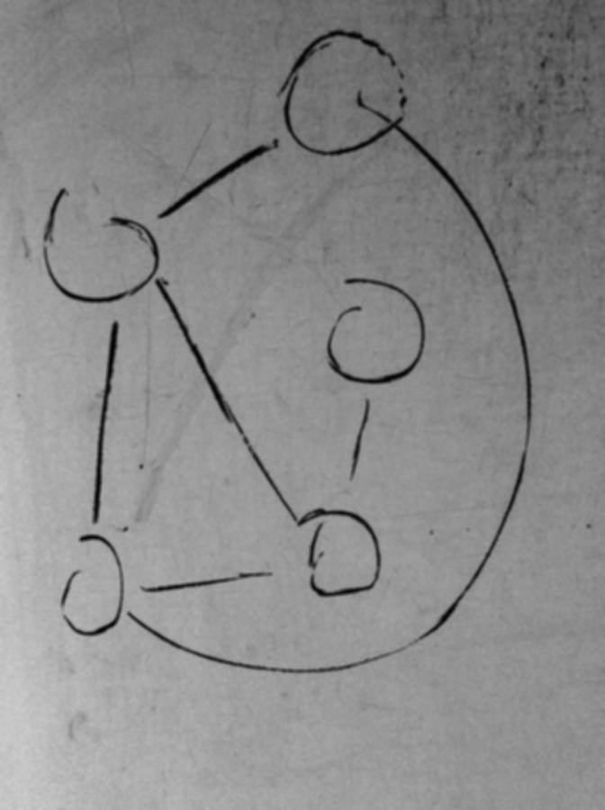
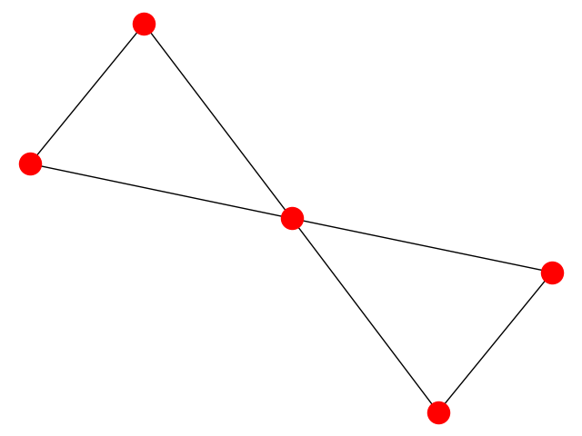

# Оцифровка графов
Автор: Ромакин Д.В.

Привет всем читателям Habrahabr!
В продолжение первой статьи я хочу поделиться с вами как я решил проблему нахождения ребер графа. Но перед этим я хотел бы напомнить про описание системы, чтобы не возникло путаницы в последовательности.

## Описание системы
Программа разбита в несколько этапов:

1. На вход поступает изображение.
2. Запускается скрипт для подготовки данных (удаление шумов и инвертирование цветов в 1 канал).
3. Поиск вершин VertexSearch. На изображении с помощью каскадов Хаара ищем вершины графа, затем запускаем фильтрацию, которая позволяет уменьшить количество ошибок от каскадов.
4. Поиск ребер EdgeSearch. Определяем координаты пересечения ребер и вершин.
5. Алгоритм **Tracker**. Находим ребра и какие вершины эти ребра соединяют.
6. Составляется удобный формат для дальнейшей визуализации.

## Определение ребер графа - Edge Search
Для того, чтобы определить какие вершины графа соединены между собой, необходимо знать:
- Область начала ребра (линии)
- Область пересечения ребра (линии) с другими

Были протестированы 2 алгоритма для поиска области начал ребра и области пересечения ребра с другими:

Поиск областей начал ребер | Результат | Поиск областей пересечений ребер | Результат
--- | --- | --- | ---
Каскады Хаара | Любой шум, который есть на изображении (точка, иное множество пикселей) может стать областью началом ребра, поэтому число ложных срабатываний оказалось достаточно велико. По этой причине пришлось отказаться от данной идеи. | Каскады Хаара | Использование каскадов не подходит из-за малой точности и большой погрешности. Некоторый процент распознанных областей начал ребер и областей пересечений является ложным срабатыванием, поэтому точность еще ниже, чем предполагалось.
Hough Lines |  Используя алгоритм HoughLinesP из библиотеки OpenCV, удалось достичь очень хорошего результата, но у него есть один большой минус, который не позволил его использовать в данной задаче - подбор параметров функции для каждого изображения. Ниже можно увидеть результат работы алгоритма:  | Сращивание маленьких линий с помощью Hough Lines | На основе алгоритма HoughLinesP была создана программа, которая позволяет разбить ребро после обработки алгоритмом Canny из OpenCV на маленькие линии, чтобы срастить их потом в одну. Результат очень хороший, но как и для поиска начал - необходимо подбирать параметры функции для каждого изображения. Ниже можно увидеть результат работы алгоритма:

### Вывод
Ни один из предложенных алгоритмов не подходит, поэтому был создан свой алгоритм с названием **Tracker**, который "пробегается" по пикселям ребер графа на изображении.

## Tracker
Tracker работает в 3 этапа:
1. Поиск области начала ребер;

2. Проход по пикселям ребер графа на изображении;

3. Определение принадлежит ли ребро данной вершине.

### Поиск области начала ребер
В данном случае используется метод вспомогательных прямоугольников, пересечение с ребрами которых позволяет найти область начала ребра, а впоследствии как область начала движения для Tracker.

#### Этапы работы:
1. На вход алгоритму Canny подаем обработанное изображение;

  

2. С помощью свертки соединяем 2 линии после алгоритма Canny;

  

3. Уменьшаем размер линии до малого числа пискселей, чтобы не было разрыва;

  

4. То множество пикселей, которое попало в область **дополнительных прямоугольников** - удаляется, сохраняя множества пикселей, которые попали на пересечения самых больших для каждой вершины прямоугольников и ребер графа;

  

5. Белая часть - это множество пикселей пересечения, поэтому вычисляем центральный пиксель пересечения для каждой области;

  

6. Получаем области (окружности) начала ребра, центрами которых являются центральные пиксели;

  

7. После удаления в 5 пукте находим ребра графа (множество пикселей), по которым будет передвигаться Tracker.

  

P.s. **Дополнительные прямоугольники** строятся на основе выделенной области Хаара.

Ниже можно увидеть окончательный результат 7 шагов:

### Проход по пикселям ребер графа на изображении
Для того, чтобы подтвердить, что ребро принадлежит данным двум вершинам, необходимо, чтобы Tracker "пробежался" от одной вершины к другой, хотя бы один раз.

#### Как двигается Tracker?
Движение основано на пересечении ребра графа (траекторией движения Tracker) с окружностью, которая строится, используя координаты центрального пикселя.

##### Алгоритм движения
1.	Используя координаты центрального пикселя области начала ребра (линии), строится красная окружность;
2.	Находится пересечение красной окружности с пикселями ребра (дороги) Tracker;
3.	Множество пикселей пересечения приводится к одному пикселю пересечения, который является центральным пикселем для новой окружности;
4.  Рисуется новая окружность, центром которой является новый центральный пиксель пересечения;
5.	Циклически выполняем 2-4, до тех пор, пока не встретим:
  - Другую точку начала линии;
  - Последнюю область (последний пиксель) ребра (окончание дороги).

Движение Tracker | Траектория движения Tracker
------------ | -------------
 | 

#### Что происходит при различных выходах на 5 этапе?
Включается алгоритм Tracker Shoot, который проверяет соединено ли ребро с вершиной графа (красным прямоугольником Хаара). Более подробно в главе про Tracker Shoot.

### Tracker Shoot
Данный алгоритм начинает работать после встречи одно из условий 5 этапа алгоритма движения Tracker.
Рассмотрим работу на примере.

Tracker Shoot | Tracker Shoot Zoom
------------ | -------------
 | 

**Слева** на картинке изображен Tracker Shoot, а **справа** - увеличенная картинка Tracker Shoot.

#### Как работает Tracker Shoot?
1. При выходе на 5 этапе из алгоритма движения Tracker в обоих случаях сохраняются координаты центральных пикселей данной окружности и предыдущей (если встретили другую точку начала - белая и красная окружности, если последнюю область ребра - 2 последние красные окружности).
2. Используя выражение прямой  и имея 2 пары координат центральных пикселей, находим угловой коэффициент  для данного ребра.
3. Используя координаты ближайших вершин прямоугольника относительно координат последнего центрального пикселя (белой или красной окружности в зависимости от выхода на 5 этапе) получаем границы значений углового коэффициента, при которых данное ребро соединено с вершиной графа.
4. Если угловой коэффициент  лежит в границах значений, то ребро соединяет 2 вершины, иначе - ребро огибает вершину.

**P.s.** Если коэффициент находится в допустимой области, то картинка будет такая же как сверху.

## Проблемы
### Основные проблемы
1.	При разрыве линии алгоритм движения Tracker может остановиться, т.к. в провал попадет точка пересечения окружности с траекторией Tracker;
2.	При пересечении линий алгоритм не работает;

####  Пример проблемы:

3.	Определение точек начала линии иногда дает плохой результат, если какая-либо линия проходит рядом с областью вершины (пример ниже);

####  Пример проблемы:

Original image -> Preprocessing | Vertex Search with action | Find Start | Tracker | Result
--- | --- | --- | --- | ---
 |  |  |  | 

4. Для корректной работы этапа подготовки необходимо указывать индекс для фотографии, которая поступает на вход;
5. Отсутсвие многопоточности, для поиска вершин и Tracker.

## Примеры
### Положительный результат
Original image -> Preprocessing | Vertex Search | Find Start | Tracker | Result
--- | --- | --- | --- | ---
 |  |  |  | 
 |  |  |  | 
 |  |  |  | 

###  Пример с дополнительным фильтром пересечений:
Original image -> Preprocessing | Vertex Search with action | Find Start | Tracker | Result
--- | --- | --- | --- | ---
 |  |  |  | 

## Заключение
В двух статьях были рассмотрены все этапы оцифровки графов, проблемы и результаты работы. Надеюсь читатели нашли в них что-то полезное. Еще я надеюсь на то, что удалось показать, что данная задача вполне решаемая.

## Литература
1.  https://www.pyimagesearch.com/2017/08/21/deep-learning-with-opencv/
2.  https://www.pyimagesearch.com/category/object-detection/
2.	https://habr.com/ru/post/309508/
3.  https://habr.com/ru/post/312450/
3.	https://www.asozykin.ru/courses/nnpython-intro
4.	https://proglib.io/p/neural-nets-guide/

## Github
Весь актуальный код можно найти в репозитории и потестировать, если будет желание.
[Мой Github](https://github.com/Dmitriy1594/NeiroGraphDetect)
